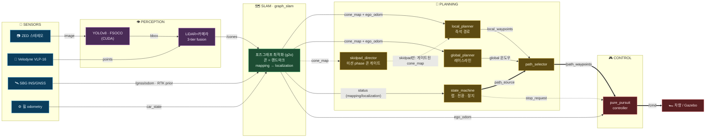

<div align="center">

# 🏎️ HYU Formula Student — Autonomous Stack

**Perception → SLAM → Planning → Control**, 시뮬레이터에서 완전 자율주행까지.


</div>

---

## ⚡ Quick Start

```bash
race            # 이거 하나. YOLO+LiDAR perception + SLAM + planning 전체가 뜨고 차가 스스로 달림
race sim        # Gazebo simulated /cones로만 돌릴 때
race stop       # 전부 종료   |   race attach — 재접속
```

tmux 창 하나에 4개 pane이 뜹니다: ①sim+perception ②planning(SLAM+global/local+상태기계+selector+controller) ③미션 자동 ARM ④라이브 모니터(path_source/state/lap/CTE). **teleop 불필요** — 컨트롤러가 유일한 `/cmd` writer로 직접 주행합니다.

<details>
<summary><b>모듈별로 따로 띄우려면</b></summary>

```bash
simfull track:=small_track    # ① sim + Gazebo /cones (+RViz, YOLO 없음)
pbring                        # ② planning 전체 (자체 graph_slam 포함 — slam 계열과 같이 켜지 말 것)
mission                       # ③ 미션 ARM → 5초 뒤 자율주행 시작
```
계획만 보고 싶으면 `pbring enable_controller:=false`, 수동 주행은 그 상태에서 `teleop`.
</details>

---

## 🧭 파이프라인

센서 → 인지 → SLAM → 계획 → 제어. 모든 화살표는 실제 토픽입니다.



- **PERCEPTION**은 카메라·LiDAR만 소비해 `/cones`(색·위치·공분산) 하나로 요약합니다. sim 모드에선 Gazebo 플러그인이 이 토픽을 직접 냅니다.
- **SLAM**은 `/cones` + 휠 odometry + (RTK일 때만) GNSS prior로 콘 랜드마크 포즈그래프를 풀어 **cone_map과 ego_odom**을 만들고, 루프 클로저가 확정되면 localization으로 전환합니다.
- **PLANNING**에서 state_machine이 랩·상태 기반으로 `path_source`를 정하고, selector가 local/global 중 하나를 `/path_waypoints`로 확정 — **컨트롤러는 항상 이 토픽 하나만** 봅니다. skidpad 미션에선 director가 cone_map을 phase별로 걸러 local planner에 공급합니다.

**2단계 주행 시나리오** — 이게 설계의 핵심입니다:

| 단계 | path_source | 무슨 일이 |
|---|---|---|
| **랩 1 · 탐험** | `LOCAL` | SLAM이 누적한 **콘맵과 현재 pose로 local 경로** 생성, SLAM은 주행하며 콘맵 보강 |
| **핸드오프** | — | 랩 완주 → SLAM `localization` 전환 → global_planner가 콘맵에서 **레이스라인** 생성 → selector가 안전 전환 |
| **랩 2+ · 레이싱** | `GLOBAL_FULL` | 컨트롤러가 레이스라인 롤링 윈도우 추종. HUD `TRACKING` 줄이 추종 오차(d) 표시 |
| **종료** | — | state_machine이 스톱존 감지 → `stop_request` → 제동 |

컨트롤러는 항상 `/path_waypoints` 하나만 봅니다 — local이냐 global이냐는 selector가 숨겨줍니다.

---

## 🛠️ Setup

> 아래 전부 **새 컴퓨터 기준 처음부터**입니다. 워크스페이스 위치는 자유입니다
> (예시는 `~/fsk`) — 스크립트·launch가 전부 자기 위치 기준으로 경로를 찾습니다.

### 0. 클론

```bash
mkdir -p ~/fsk && cd ~/fsk
git clone <repo-url> src        # 이 저장소가 워크스페이스의 src/가 됩니다
# (선택) 시스템 g2o(ros-humble-libg2o) 대신 소스 g2o를 쓰려면:
#   git clone https://github.com/RainerKuemmerle/g2o.git ~/fsk/g2o
#   — eufs_graph_slam이 시스템 g2o가 없으면 <워크스페이스>/g2o를 자동 탐지
```

### 1. 시스템 의존성 (apt)

```bash
sudo apt update && sudo apt install -y \
  python3-colcon-common-extensions python3-rosdep python3-vcstool python3-venv \
  gazebo ros-humble-gazebo-dev ros-humble-gazebo-ros ros-humble-gazebo-plugins \
  ros-humble-sbg-driver ros-humble-libg2o ros-humble-rviz-2d-overlay-plugins \
  python3-pandas python3-opencv \
  libeigen3-dev libboost-dev libspdlog-dev libomp-dev

sudo rosdep init 2>/dev/null; rosdep update   # 최초 1회
```

| 패키지 | 쓰는 곳 |
|---|---|
| `gazebo` + `gazebo-*` | 시뮬레이터 |
| `sbg-driver` | INS/GNSS 브리지 (ins_pipeline) |
| `libg2o` | graph SLAM 최적화 |
| `rviz-2d-overlay-plugins` | RViz HUD (CTE/상태/GNSS) |
| `eigen / boost / spdlog / omp` | frenet_conversion (CLCS) |
| `pandas / opencv` | eufs_launcher·eufs_tracks (pandas), trajectory_generator·perception (opencv) |

### 2. 외부 소스 & 파이썬 환경

```bash
# (a) frenet_conversion이 컴파일하는 CommonRoad-CLCS
git clone --depth 1 https://github.com/CommonRoad/commonroad-clcs.git ~/commonroad-clcs
export COMMONROAD_CLCS_DIR="$HOME/commonroad-clcs"

# (b) trajectory_generator용 (시스템 파이썬)
python3 -m pip install --user quadprog

# (c) race 기본 perception pipeline에 필요한 YOLO 격리 venv
#     반드시 시스템 파이썬(3.10)으로 만드세요 — conda 활성 상태면 rclpy가 깨집니다.
/usr/bin/python3 -m venv --system-site-packages ~/fsk/.venv-yolo
source ~/fsk/.venv-yolo/bin/activate
pip install -U pip
pip install torch torchvision --index-url https://download.pytorch.org/whl/cu124  # GPU
pip install ultralytics "numpy<2"          # numpy<2 = ROS/cv_bridge ABI 호환
pip uninstall -y opencv-python              # 시스템 cv2 사용
deactivate
```

> 기본 `race`는 CUDA YOLO+LiDAR perception을 실행합니다. GraphSLAM이 `map` TF를 소유하므로 real perception의 cross-time 보정 프레임은 기본 `odom`이고, SLAM 맵 오염을 막기 위해 LiDAR support 없는 visual-only fallback은 기본으로 끕니다. Gazebo simulated `/cones`만 쓰려면 `race sim` 또는 `perception_mode:=sim`을 명시합니다.
>
> **YOLO 체크포인트는 저장소에 포함**되어 있습니다 (`eufs_perception_baseline/models/fsoco_yolov8n/weights/best.pt`) — 노드가 소스 트리에서 자동으로 찾으므로 별도 배치가 필요 없고, 다른 모델을 쓸 때만 `yolo_model_path:=<file>`을 넘깁니다. venv는 launch가 `$EUFS_MASTER/.venv-yolo` → 시스템 파이썬 순으로 자동 감지합니다.

### 3. 빌드

```bash
cd ~/fsk && export EUFS_MASTER=$PWD
rosdep install --from-paths src --ignore-src -r -y
colcon build --symlink-install --base-paths src
```

### 4. Shell aliases — 한 줄이면 끝

`~/.bashrc` 또는 `~/.zshrc` 맨 아래에 **이 한 줄**만 추가하세요 (bash·zsh 공용):

```bash
source ~/fsk/src/scripts/fsk-shellrc
```

이 파일이 자기 위치에서 워크스페이스를 찾아 `EUFS_MASTER`·`COMMONROAD_CLCS_DIR`·
`ROS_LOCALHOST_ONLY`를 설정하고 ROS/워크스페이스를 소싱한 뒤, 아래 함수들을 등록합니다:

| 명령 | 역할 |
|---|---|
| `race [track] [sim\|real] [args...]` | 자율주행 전체 스택 (tmux). `race stop` / `race attach` |
| `fsb` | 빌드 + 소싱 · `fsk` — 워크스페이스로 cd |
| `simfull` / `pbring` / `teleop` | sim+perception / planning 전체 / 키보드 주행 |
| `mission [ami]` / `resetcar` / `slamreset` / `rv` | 미션 ARM(기본 14) / 차 원위치 / 매핑 재시작 / RViz |

워크스페이스가 `~/fsk`가 아니면 그 경로의 `src/scripts/fsk-shellrc`를 소싱하면 됩니다 —
나머지는 알아서 맞춰집니다. 적용: 새 터미널 또는 `source ~/.bashrc`.

> ⚠️ **conda 주의**: conda 환경이 활성화된 셸에서 `race`를 실행하면 ROS 파이썬
> 노드들이 conda 파이썬으로 떠서 즉사합니다. `conda deactivate` 후 실행하세요.

---

## ▶️ Running — 모드별 가이드

### 🏁 Trackdrive (기본 미션)
랩 1은 local 경로로 탐험·매핑, 랩 완주 후 global 레이스라인으로 핸드오프.
```bash
race                # small_track, CUDA YOLO+LiDAR perception (기본)
race sim            # 같은 트랙, Gazebo simulated /cones (YOLO 없음 — 가볍고 빠름)
race peanut         # 다른 트랙 (eufs_tracks/csv/ 의 이름)
race peanut sim gazebo_gui:=true    # 트랙/모드 뒤 인자는 simulation.launch.py로 전달
```
모니터 pane에서 `path_source: LOCAL → GLOBAL_FULL` 전환과 CTE를 실시간으로 봅니다.

### 🛞 Skidpad (8자 미션)
트랙 이름이 `skidpad*`면 **자동으로 skidpad 프로필**로 뜹니다: global planner 없이
local planner만, skidpad_director가 미션 단계(진입→우측 원×N→좌측 원×N→탈출→정지)별로
콘 피드를 게이트, AMI_SKIDPAD(12)로 ARM.
```bash
race skidpad_kase2026 real   # 넓은 버전 (KASE 2026)
race skidpad real            # 좁은 표준 skidpad
race skidpad sim             # simulated perception으로도 동일하게 동작
```
자주 만지는 튜닝 (전부 launch 인자/파라미터 — 코드 수정 불필요):

| 항목 | 위치 | 기본값 |
|---|---|---|
| 원별 바퀴 수 | `pbring skidpad:=true skidpad_right_laps:=N skidpad_left_laps:=N` | 2 / 2 |
| 콘 여유 (바깥 바이어스) | skidpad_director 파라미터 `circle_outward_bias_m` | 0.5 m |
| 주행 속도 | `planning/local_planner/config/local_planner_skidpad.yaml` | 4.0 m/s |
| 컨트롤러 (lookahead·상한) | `pure_pursuit_controller/config/pure_pursuit_controller_skidpad.yaml` | 3.0 m / 4.0 m/s |

진행 단계는 `/skidpad/phase`로 확인 (모니터 pane에 표시됨).

### 자주 쓰는 변형
```bash
pbring enable_controller:=false      # 주행 없이 계획만 (수동 개입: teleop)
pbring local_source_mode:=live_cones # local 경로 live perception 진단 override
pbring planner_source:=csv           # global을 오프라인 raceline CSV로
# 저장맵으로 localization 바로 시작 (랩1 탐험 생략):
pbring graph_slam_localization_mode:=true \
       graph_slam_load_map_path:=$EUFS_MASTER/src/eufs_graph_slam/map/small_track_slam.csv
```

### 진행 확인
```bash
ros2 topic echo /planning/path_source   # LOCAL? GLOBAL_FULL?
ros2 topic echo /planning/cte           # 경로 추종 횡오차 d(m)
ros2 topic echo --once /ros_can/state_str
```

### INS/SBG 파이프라인 (선택)
실제 하드웨어 GNSS/INS 경로를 시뮬에서 검증할 때:
```bash
ros2 launch eufs_graph_slam ins_pipeline.launch.py
```

`race`는 GNSS HUD만 채우도록 `ins_pipeline.launch.py slam:=false`를
자동으로 같이 띄웁니다. `pbring`을 수동으로 켠 상태에서 GNSS HUD만 보고
싶으면 같은 방식으로 graph_slam 중복 없이 실행하세요:

```bash
ros2 launch eufs_graph_slam ins_pipeline.launch.py slam:=false
```

---

## 🗺️ Reference

<details>
<summary><b>핵심 토픽</b></summary>

| 토픽 | 타입 | 의미 |
|---|---|---|
| `/cones` | `ConeArrayWithCovariance` | perception 콘 검출 (base_footprint) |
| `/localization/cone_map` | `ConeArrayWithCovariance` | SLAM 콘 맵 (map) |
| `/localization/ego_odom` | `Odometry` | SLAM 위치추정 |
| `/graph_slam/status` | `String` | `mapping` / `localization` |
| `/global_waypoints` (+`/path`) | `WaypointArrayStamped` | 전역 레이스라인 (latched) |
| `/planning/local_waypoints` (+`/path`) | `WaypointArrayStamped` | 로컬 즉석 경로 |
| `/planning/path_source` | `String` | 상태기계의 경로 선택 (`LOCAL`/`GLOBAL_FULL`/`GLOBAL_FINAL_STOP`/`STOP`) |
| `/path_waypoints` (+`/path`) | `WaypointArrayStamped` | **selector 확정 경로 = 컨트롤러 입력** |
| `/car_state/frenet/odom` | `Odometry` | Frenet (x=s, y=d) — global 기준 |
| `/planning/cte`, `/planning/cte_rmse` | `Float32` | 추종 횡오차 d, 누적 RMSE |
| `/planning/local_path_reason`, `/planning/global_path_reason` | `String` | 경로 invalid **이유** (valid면 빈 문자열) |
| `/planning/lap_count` | `Int32` | 완료 랩 수 (orange 게이트 통과 기준) |
| `/planning/lap_time_last`, `/planning/lap_time_best` | `Float64` | 직전/최고 랩타임 (초) |
| `/planning/stack_hud` (+`_banner`) | `OverlayText` | RViz 스택 HUD 보드/배너 (stack_hud 노드) |
| `/cmd` | `AckermannDriveStamped` | 컨트롤러 출력 (유일 writer) |

</details>

<details>
<summary><b>주요 서비스</b></summary>

```bash
ros2 service call /ros_can/set_mission eufs_msgs/srv/SetCanState '{ami_state: 14}'  # 주행 미션
ros2 service call /ros_can/reset_vehicle_pos std_srvs/srv/Trigger                   # 차 원위치
ros2 service call /graph_slam/start_mapping  std_srvs/srv/Trigger                   # 매핑 모드
ros2 service call /graph_slam/save_map       std_srvs/srv/Trigger                   # 맵 CSV 저장
```
</details>

---

## 🎛️ RViz

`race`/`simfull`이 정리된 config로 RViz를 띄웁니다 (또는 `rv`). 디스플레이는 **Sensors / Perception / SLAM / Planning / HUD** 그룹, 콘은 실제 3D 메시.

- **HUD**: **Stack HUD 보드**(좌상단) — perception/SLAM/global/local/selector/control/mission/tracking을 스테이지별 색상(●초록 정상 · ▲노랑 주의 · ✕빨강 장애 · ○회색 대기)으로 표시하고, 막힌 스테이지는 **실패 이유를 그 줄에 그대로** 보여줌 (예: `GLOBAL ✕ boundary gap 13.5 m exceeds 12 m`). **배너**(상단 중앙) — "지금 차가 뭘 하는지" 한 줄: `LAP 1 · MAPPING · LOCAL · 2.9 m/s` → `RACING · GLOBAL · lap 2/4` → `⚑ FINISHED`, 문제 시 빨간 `✕ NO PATH → BRAKING — <이유>`. `GNSS`는 INS 파이프라인 실행 시 보드 아래 채워짐
- **원클릭 프리셋**: 아무 RViz에서나 `Add → By display type → fsk_rviz_presets → FSK Full Stack` — 토픽·QoS까지 세팅된 그룹이 통째로 추가

---

## 🧩 Packages

```
eufs_sim/                 시뮬레이터 (Gazebo, 차량 URDF, 센서, 플러그인, 런처)
eufs_msgs/                EUFS 메시지/서비스
eufs_graph_slam/          graph SLAM + INS/SBG 브리지 + CTE 모니터
eufs_perception_baseline/ YOLOv8 + LiDAR-camera fusion → /cones
eufs_teleop/              키보드 주행
fsk_rviz_presets/         RViz 원클릭 디스플레이 그룹
pure_pursuit_controller/  경로 추종 제어 → /cmd (planning과 분리된 control 계층)
scripts/                  race.sh (자율 전체 스택 tmux 런처)
planning/
  ├─ planning_bringup/    ★ planning 전체 조립 launch (아래 전부 + graph_slam + controller)
  ├─ local_planner/       라이브 콘 → 즉석 로컬 경로 (랩 1)
  ├─ global_planner/      SLAM 콘맵 → 전역 레이스라인
  ├─ frenet_conversion/   전역경로 기준 Frenet (s,d) — CTE의 원천
  ├─ state_machine/       랩 카운트 · local↔global 전환 · 스톱존
  ├─ path_selector/       local/global 중 컨트롤러가 따를 경로 확정
  └─ trajectory_generator/ 오프라인 raceline (CSV)
```

---

## 🩹 Troubleshooting

<details>
<summary><b>차가 안 움직임</b></summary>

미션 미설정이 대부분. `race`는 자동 ARM하지만 수동 실행이면 `mission` → `/ros_can/state_str`가 `AS:DRIVING`인지 확인. `/reset_world`는 차를 못 되돌리니 `resetcar`.
</details>

<details>
<summary><b>주행해도 콘맵이 안 참 / 전역경로가 안 생김</b></summary>

SLAM이 `localization` 모드면 새 콘을 안 쌓습니다 — `slamreset`으로 매핑 모드 복귀 후 주행. 전역경로는 **랩 완주 → localization 전환 후** 생성됩니다 (`/graph_slam/status` 확인).
</details>

<details>
<summary><b>perception 결과(/cones)가 안 나옴 / 매핑이 너무 느림</b></summary>

GPU가 죽으면(과거 Xid 폴트) YOLO가 CPU 폴백으로 돌며 CPU를 포화시켜 RTF가 붕괴합니다 → 재부팅으로 GPU 복구가 근본 해결. `nvidia-smi`와 `/cones` rate 확인.
</details>

<details>
<summary><b>CTE HUD가 계속 "waiting"</b></summary>

정상일 수 있음 — CTE는 **전역 레이스라인 기준**이라 global 단계 전(랩 1 local 주행)엔 데이터가 없습니다. global 전환 후에도 waiting이면 `/planning/global_path_valid` 확인.
</details>

<details>
<summary><b><code>ros2 topic hz</code>가 이상하게 낮음</b></summary>

`hz`는 벽시계 기준 → Gazebo RTF만큼 낮게 보입니다. 알고리즘은 sim-time 기반이라 무관.
</details>

<details>
<summary><b>graph_slam이 두 개 뜸 / TF 충돌</b></summary>

`pbring`(또는 `race`)은 자체 graph_slam을 띄웁니다 — 별도
`graph_slam.launch.py`나 기본 `ins_pipeline.launch.py`를 동시에 켜지 마세요.
GNSS HUD publisher만 필요하면 `ins_pipeline.launch.py slam:=false`로 실행합니다.
</details>

<details>
<summary><b>빌드/토픽이 안 보임</b></summary>

워크스페이스 미소싱. 새 터미널을 열거나 `fsk && source install/setup.zsh`. 빌드는 `fsb`.
</details>

---

<div align="center">
<sub>Built on <a href="https://gitlab.com/eufs">EUFS Simulator</a> (MIT). © HYU Formula Student.</sub>
</div>
