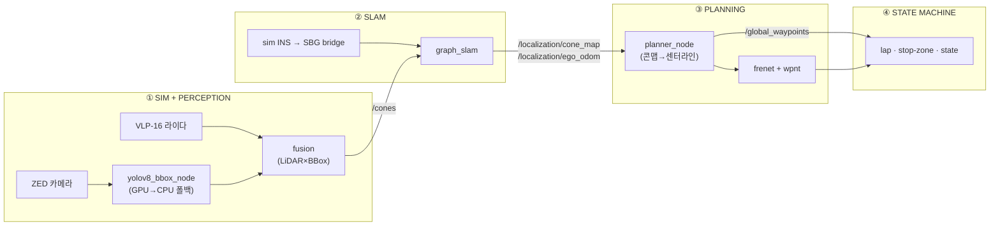

<div align="center">

# 🏎️ HYU Formula Student — Autonomous Stack

**Perception → SLAM → Planning**, all driven inside the EUFS Gazebo simulator.


</div>

---

## 🧭 파이프라인 한눈에



| 단계 | alias | 입력 → 출력 |
|---|---|---|
| ① Sim + Perception | `simfull` | 센서 → **`/cones`** (콘 검출) |
| ② SLAM | `slam` | `/cones` + INS → **`/localization/cone_map`, `/localization/ego_odom`** |
| ③ Planning | `plan` | 콘맵 → **`/global_waypoints`** (전역 레이스라인) |
| ④ State machine | `smachine` | 랩/스톱존/주행 상태 |

---

## ⚡ Quick Start

**한 방에 (권장)** — tmux 창 하나에 전체 스택이 단계별 pane으로 뜨고, 순서·미션까지 자동:

```bash
race                     # = race small_track   |   종료: race stop
```

<details>
<summary>또는 <b>수동으로 터미널 4개</b></summary>

```bash
simfull track:=small_track gazebo_gui:=true rviz:=true   # ① 시뮬 + perception
slam                                                     # ② SLAM
plan && smachine                                         # ③④ planning + 상태기계
mission                                                  # 미션 ON → 5초 뒤 주행 가능
teleop                                                   # 키보드로 한 바퀴 주행
```
</details>

주행으로 한 바퀴 돌면 `/localization/cone_map`이 채워지고, SLAM이 `localization`으로 전환되면 `/global_waypoints`(초록 레이스라인)가 RViz에 뜹니다.

<details>
<summary><b>❗ 처음이라 아직 셋업 전이라면 → 아래 Setup부터</b></summary>

`simfull` 같은 alias는 <a href="#4-shell-aliases">Shell aliases</a>를 `.zshrc`/`.bashrc`에 넣어야 동작합니다.
</details>

---

## 🛠️ Setup

### 1. 시스템 의존성 (apt)

```bash
sudo apt update && sudo apt install -y \
  python3-colcon-common-extensions python3-rosdep python3-vcstool python3-venv \
  gazebo ros-humble-gazebo-dev ros-humble-gazebo-ros ros-humble-gazebo-plugins \
  ros-humble-sbg-driver ros-humble-libg2o ros-humble-rviz-2d-overlay-plugins \
  python3-pandas python3-opencv \
  libeigen3-dev libboost-dev libspdlog-dev libomp-dev

# rosdep 최초 1회
sudo rosdep init 2>/dev/null; rosdep update
```

| 패키지 | 쓰는 곳 |
|---|---|
| `gazebo` + `gazebo-*` | 시뮬레이터 |
| `sbg-driver` | SLAM의 INS/GNSS 브리지 |
| `libg2o` | graph SLAM 최적화 |
| `rviz-2d-overlay-plugins` | RViz HUD 오버레이 |
| `eigen / boost / spdlog / omp` | frenet_conversion (CLCS) |
| `pandas / opencv` | trajectory_generator, perception |

### 2. 외부 소스 & 파이썬 환경

```bash
# (a) frenet_conversion이 컴파일하는 CommonRoad-CLCS
git clone --depth 1 https://github.com/CommonRoad/commonroad-clcs.git ~/commonroad-clcs

# (b) trajectory_generator용 (시스템 파이썬)
python3 -m pip install --user quadprog

# (c) YOLO 추론 전용 격리 venv (torch가 ROS numpy를 깨지 않도록 분리)
python3 -m venv --system-site-packages ~/fsk/.venv-yolo
source ~/fsk/.venv-yolo/bin/activate
pip install -U pip
pip install torch torchvision --index-url https://download.pytorch.org/whl/cu124  # GPU
pip install ultralytics "numpy<2"          # numpy<2 = ROS/cv_bridge ABI 호환
pip uninstall -y opencv-python              # 시스템 cv2 사용
deactivate
```

> YOLO 체크포인트는 `eufs_perception_baseline/models/fsoco_yolov8n/weights/best.pt`에 둡니다. simulation launch가 이 venv를 자동 감지합니다.

### 3. 빌드

```bash
cd ~/fsk && export EUFS_MASTER=$PWD
rosdep install --from-paths src --ignore-src -r -y   # 나머지 ROS 의존성
colcon build --symlink-install
```

### 4. Shell aliases

`~/.zshrc` (또는 `~/.bashrc`) 맨 아래에 붙여넣으세요 — bash·zsh 공용입니다:

```bash
# ===== HYU Formula Student =====
export EUFS_MASTER="$HOME/fsk"
if [ -n "$ZSH_VERSION" ]; then _fsk_ext=zsh; else _fsk_ext=bash; fi
[ -f "$EUFS_MASTER/install/setup.$_fsk_ext" ] && source "$EUFS_MASTER/install/setup.$_fsk_ext"

# 워크스페이스
alias fsk='cd "$EUFS_MASTER"'
alias fsb='cd "$EUFS_MASTER" && colcon build --symlink-install && source install/setup.$_fsk_ext'

# 전체 스택 한 방 (tmux) — race stop 으로 종료, race attach 로 재접속
alias race='$EUFS_MASTER/src/scripts/race.sh'

# 실행 (① 시뮬 · 퍼셉션)
alias sim='ros2 launch eufs_launcher eufs_launcher.launch.py'          # 런처 GUI
alias simrun='ros2 launch eufs_launcher simulation.launch.py'          # 직접 실행 (track:=, perception:=)
alias simfull='ros2 launch eufs_launcher simulation.launch.py perception:=true'   # 시뮬+YOLO

# 실행 (② SLAM)
alias slam='ros2 launch eufs_graph_slam ins_pipeline.launch.py'        # INS→SBG→graph SLAM
alias slamcore='ros2 launch eufs_graph_slam graph_slam.launch.py'      # graph SLAM 단독

# 실행 (③④ Planning)
alias plan='ros2 launch global_planner slam_global_planner.launch.py'         # SLAM 콘맵→레이스라인
alias plancsv='ros2 launch global_planner slam_global_planner.launch.py planner_source:=csv'
alias smachine='ros2 launch state_machine planning_state_machine.launch.py'
alias teleop='ros2 run eufs_teleop teleop'

# 헬퍼 (주행 게이트 & 리셋)
alias mission='ros2 service call /ros_can/set_mission eufs_msgs/srv/SetCanState "{ami_state: 14}"'  # TRACKDRIVE
alias asstate='ros2 topic echo --once /ros_can/state_str'             # 미션/AS 상태
alias resetcar='ros2 service call /ros_can/reset_vehicle_pos std_srvs/srv/Trigger'
alias slamreset='ros2 service call /graph_slam/start_mapping std_srvs/srv/Trigger'  # 매핑 모드로 리셋
alias rv='rviz2 -d "$EUFS_MASTER/install/eufs_launcher/share/eufs_launcher/config/default.rviz"'
```

적용: 새 터미널 열거나 `source ~/.zshrc`.

---

## ▶️ Running — 자세히

**시뮬은 반드시 미션을 걸어야 `/cmd`가 먹습니다.** `mission` → 5초 뒤 `AS_DRIVING` → 주행 가능.

```bash
# 터미널 1 — 시뮬 + perception (YOLO)
simfull track:=small_track gazebo_gui:=true rviz:=true

# 터미널 2 — SLAM (sim에선 GNSS 프라이어 꺼도 됨)
slam                    # 또는:  slam gnss_prior_enable:=false

# 터미널 3 — 미션 걸고 주행
mission
teleop                  # w/a/s/d 로 한 바퀴

# 터미널 4 — 콘맵이 양쪽 경계로 차오르면
plan
smachine
```

**🔑 매핑 vs localization** — SLAM은 처음엔 `mapping`(주행하며 맵 생성). 한 바퀴 완주하면 자동으로 `localization`(기존 맵에 위치추정)으로 전환되고, 그때 `planner_node`가 `/global_waypoints`를 만듭니다. 다시 맵을 새로 그리려면 `slamreset`.

**자주 쓰는 트랙**: `small_track` · `skidpad` · `acceleration` · `peanut` · `comp_2021` · `rand`

---

## 🗺️ Pipeline reference

<details>
<summary><b>핵심 토픽</b></summary>

| 토픽 | 타입 | 발행 |
|---|---|---|
| `/zed/left/image_rect_color` | `sensor_msgs/Image` | 시뮬 ZED |
| `/velodyne_points` | `sensor_msgs/PointCloud2` | 시뮬 VLP-16 |
| `/cones` | `eufs_msgs/ConeArrayWithCovariance` | perception fusion (base_footprint) |
| `/localization/cone_map` | `eufs_msgs/ConeArrayWithCovariance` | graph SLAM 콘 맵 (map) |
| `/localization/ego_odom` | `nav_msgs/Odometry` | graph SLAM 위치추정 |
| `/graph_slam/status` | `std_msgs/String` | `mapping` / `localization` |
| `/global_waypoints` | `eufs_msgs/WaypointArrayStamped` | 전역 레이스라인 |
| `/global_waypoints/path` | `nav_msgs/Path` | RViz 시각화용 미러 |
| `/cmd` | `ackermann_msgs/AckermannDriveStamped` | 차량 제어 입력 |

</details>

<details>
<summary><b>주요 서비스</b></summary>

```bash
ros2 service call /ros_can/set_mission eufs_msgs/srv/SetCanState '{ami_state: 14}'  # 주행 미션
ros2 service call /ros_can/reset_vehicle_pos std_srvs/srv/Trigger                   # 차 원위치
ros2 service call /graph_slam/start_mapping  std_srvs/srv/Trigger                   # 매핑 모드
ros2 service call /graph_slam/save_map       std_srvs/srv/Trigger                   # 맵 CSV 저장
```
</details>

---

## 🎛️ RViz

`simfull ... rviz:=true` 또는 `rv`로 실행. 디스플레이가 **Sensors / Perception / SLAM / Planning / HUD** 그룹으로 정리돼 있고 콘은 실제 3D 메시로 보입니다.

> **원클릭 프리셋** — 다른 RViz 세션에서도 `Add → By display type → fsk_rviz_presets → FSK Full Stack` 하면 토픽·QoS까지 세팅된 그룹이 통째로 추가됩니다.

---

## 🧩 Packages

```
eufs_sim/                 시뮬레이터 (Gazebo world, 차량 URDF, 센서, 플러그인, 런처)
eufs_msgs/                EUFS 메시지/서비스
eufs_graph_slam/          graph SLAM + INS/SBG 브리지 (ins_pipeline)
eufs_perception_baseline/ YOLOv8 + LiDAR-camera fusion → /cones
eufs_teleop/              키보드 주행
fsk_rviz_presets/         RViz 원클릭 디스플레이 그룹
planning/
  ├─ global_planner/      SLAM 콘맵 → 전역 레이스라인 (planner_node)
  ├─ frenet_conversion/   전역경로 → Frenet (CommonRoad-CLCS)
  ├─ state_machine/       랩/스톱존/주행 상태
  └─ trajectory_generator 오프라인 raceline (CSV)
```

---

## 🩹 Troubleshooting

<details>
<summary><b>주행해도 <code>/localization/cone_map</code>이 안 채워짐</b></summary>

SLAM이 `localization` 모드면 새 콘을 안 쌓습니다. `asstate`로 확인하고, 매핑을 새로 하려면 `slamreset` (start_mapping) 후 주행하세요.
</details>

<details>
<summary><b><code>/cmd</code>를 보내도 차가 안 움직임</b></summary>

미션이 안 걸림. `mission` 실행 → `asstate`가 `AS:DRIVING` 되면 주행 가능. `/reset_world`는 차를 안 되돌리니 `resetcar`를 쓰세요.
</details>

<details>
<summary><b>perception 결과(/cones)가 안 나옴</b></summary>

YOLO가 CUDA를 못 쓰면 로그에 `Invalid CUDA device=0`. GPU 폴트면 재부팅이 필요하고, 그 전까지는 노드가 자동으로 **CPU 폴백**해서 계속 동작합니다 (느림). 시뮬 콘만 빠르게 보려면 `simrun ... perception:=false launch_group:=no_perception`.
</details>

<details>
<summary><b><code>ros2 topic hz</code> 레이트가 이상하게 낮음</b></summary>

`hz`는 벽시계 기준이라 Gazebo 실시간계수(RTF)만큼 낮게 보입니다 (YOLO+렌더링이 무거우면 RTF↓). SLAM 정확도는 sim-time 기반이라 무관합니다.
</details>

<details>
<summary><b>런처 GUI(<code>sim</code>)에서 perception이 안 켜짐</b></summary>

GUI 런처는 perception 인자를 전달하지 못합니다. 실제 파이프라인은 `simfull`(또는 `simrun perception:=true`)로 실행하세요.
</details>

<details>
<summary><b><code>eufs_msgs</code> / Gazebo 플러그인을 못 찾음</b></summary>

워크스페이스를 source 안 했을 때입니다. `fsk && sor` (또는 새 터미널). 빌드가 필요하면 `fsb`.
</details>

---

<div align="center">
<sub>Built on <a href="https://gitlab.com/eufs">EUFS Simulator</a> (MIT). © HYU Formula Student.</sub>
</div>
