<div align="center">

# 🏎️ HYU Formula Student — Autonomous Stack

**Perception → SLAM → Planning → Control**, 시뮬레이터에서 완전 자율주행까지.


</div>

---

## ⚡ Quick Start — 3단계 실행

**실차는 한 줄**입니다:

```bash
race trackdrive 10        # 센서+perception+vehicle state+ECU 브리지+INS+SLAM+planning+control 동시 기동 → 한 번 대기 → 미션 ARM
race skidpad 2 | race acceleration | race autocross | race dlc | race inspection
mission go | mission halt # AS 버튼 대용 (물리 버튼 드라이버가 붙기 전까지) — ON이면 SLAM 지도 초기화 후 ECU enable, OFF는 즉시 해제
race status | race attach | race stop
```

이 뒤로 `/vehicle/cmd`에는 진짜 주행 명령이 흐르고, **실제로 움직일지는 ECU가 브리지의
autonomous-enable 바이트로 판단**합니다: `/vehicle/as_state`가 AS_DRIVING(= AS 버튼 ON)일 때만 1이고,
OFF→ON마다 브리지가 먼저 `/graph_slam/reset`으로 지도를 비운 뒤에야 1을 올립니다(ON→OFF는 즉시 0).
`/vehicle/as_state`·`/vehicle/set_mission`·`reset`·`ebs`는 실차에서 `vehicle_state.py`(hyu_planning_bringup)가
제공합니다 — sim의 race-car 플러그인과 같은 계약.

단계별로는 **환경 → 스택 → 미션** 세 단계입니다(`race <미션>`이 이 셋을 순서대로 실행). 실차와 sim은
1단계만 다르고 2·3단계는 동일합니다. **3단계 전에는 차가 못 움직입니다** —
`mission`만이 `/vehicle/set_mission`을 호출해 미션을 고르고, 실차는 거기에 AS 버튼이 더해집니다.

```bash
# ① 환경 — 하나만 선택
sim                       # sim: small_track + YOLO+LiDAR perception (기본)
sim small_track sim       # sim: Gazebo ground-truth 콘 (YOLO 없음 — 가볍고 빠름)
sim skidpad real          # 트랙만 여기서 고름 (eufs_tracks/csv/ 이름). 미션은 ③에서
sim small_track lite      # Gazebo 없는 경량 시뮬(hyu_lite_sim): Jetson에서 도는 시뮬. 차량+ECU(실 bridge
                          #   루프백 UDP, 바퀴별 RPM)+raw SBG+perception 에뮬, 코스 밖 클러터=unknown 콘.
                          #   eufs가 안 빌드된 곳에선 'sim small_track'만 쳐도 lite. 옵션: clutter:=N seed:=N
                          #   ecu:=udp|ros button:=auto|manual fix:=.. (src/sim/hyu_lite_sim/README.md)
fsk                       # 실차: 센서 드라이버 + perception (RViz는 'fsk rviz'로 opt-in)

# ② 스택 — INS + SLAM + planning + control, STANDBY로 대기
stack

# ③ 미션 — 이 순간부터 주행
mission trackdrive 10     # 랩 1 매핑 → global 레이스라인, 10랩 후 정지
mission autocross         # 1랩 (랩 수 지정 가능), 목표 랩에서 자동 정지
mission skidpad 2         # 진입 → 우원×2 → 좌원×2 → 탈출 → 정지
mission acceleration      # 직선 코리도 스프린트, 콘 끝나면 제동
mission inspection        # 제22조 검차 (잭 스탠드 위 구동/조향 시험)
```

같은 tmux 세션에 pane이 쌓입니다: ①sim(또는 실차 센서)+perception ②INS ③planning(STANDBY) ④모니터(path_source/state/lap/CTE/DSSI).
미션을 바꾸면 `mission`이 planning pane만 알맞은 프로필로 재기동한 뒤 ARM합니다.

```bash
mission status   # state/lap/AS/DSSI 한 번에 확인
mission go/halt  # 실차 AS 버튼 대용 (ON: 지도 초기화 → ECU enable / OFF: 즉시 해제)
mission stop     # EBS — 긴급 제동
mission reset    # standby 복귀: 차 원위치 + INS 재시작 + planning 재기동
race attach      # 세션 재접속        race stop — 전부 종료 (모든 단계; sim은 'sim stop')
sim perception   # (독립 모드) 인지 평가 — planner 없이 teleop 주행 + provenance별 채점
```

**백그라운드 실행**: ①에 `bg`를 붙이면(`sim small_track sim bg norviz` / `fsk bg` / `race trackdrive bg`) attach 없이
세션만 만듭니다 — `stack`/`mission`은 원래 attach하지 않으므로 이후 전 과정을 터미널에서 그대로
진행하고, 필요할 때만 `race attach`(빠져나오기 Ctrl-b d). TTY 없는 환경(nohup/CI)은 자동 detach.
단, 완전 헤드리스에서 real perception은 GPU LiDAR 때문에 GPU X 서버(DISPLAY)가 필요합니다 —
없으면 콘 0개로 조용히 멈춥니다(`sim` 모드는 무관).

> 처음이라면 [패치 Gazebo 빌드](#15-패치-gazebo-빌드--gpu-lidar)부터 — LiDAR가 기본 `gpu_ray`라서, stock gazebo로 뜨면 하늘이 점군에 찍힙니다.
>
> ⚠️ **실차 1단계(`fsk`)의 센서 드라이버 브링업은 아직 스텁**입니다 — LiDAR/ZED/SBG
> 드라이버가 in-tree에 없어서 pane ①이 필요한 목록만 출력하고 멈춥니다(의도된 fail-loud).
> 드라이버가 준비되면 2·3단계는 sim과 완전히 동일하게 동작합니다.

<details>
<summary><b>tmux 없이 모듈별로 따로 띄우려면</b></summary>

```bash
simfull track:=small_track    # sim + Gazebo /perception/cones (+RViz, YOLO 없음)
pbring                        # planning 전체 (자체 graph_slam 포함 — slam 계열과 같이 켜지 말 것)
ros2 service call /vehicle/set_mission hyu_msgs/srv/SetCanState '{ami_state: 14}'   # 수동 ARM
```
계획만 보고 싶으면 `pbring enable_controller:=false`, 수동 주행은 그 상태에서 `teleop`.
</details>

---

## 🧭 파이프라인

센서 → 인지 → SLAM → 계획 → 제어. 모든 화살표는 실제 토픽입니다.

```mermaid
flowchart LR
    subgraph SENS["🔌 SENSORS"]
        direction TB
        CAM["📷 ZED 스테레오"]
        LID["📡 Velodyne VLP-16"]
        SBG["🛰 SBG INS/GNSS"]
        ENC["⚙️ 휠 odometry"]
    end

    subgraph PERC["👁 PERCEPTION"]
        direction TB
        YOLO["YOLO26n-pose · 콘 키포인트<br/>(CUDA)"]
        FUSE["LiDAR 백본 + 비전 확장<br/>provenance별 융합"]
        YOLO -->|bbox| FUSE
    end

    subgraph SLAM["🗺 SLAM · graph_slam"]
        GS["포즈그래프 최적화 (g2o)<br/>콘 = 랜드마크<br/>mapping → localization"]
    end

    subgraph PLAN["🧠 PLANNING"]
        direction TB
        SKID["skidpad_director<br/>미션 phase 콘 게이트"]
        LP["hyu_local_planner<br/>즉석 경로"]
        GP["hyu_global_planner<br/>레이스라인"]
        SM["hyu_state_machine<br/>랩 · 전환 · 정지"]
        SEL["hyu_path_selector"]
        SKID -.->|"skidpad만: 게이트된 cone_map"| LP
        LP -->|local_waypoints| SEL
        GP -->|global 윈도우| SEL
        SM ==>|path_source| SEL
    end

    subgraph CTRL["🎮 CONTROL"]
        PP["pure_pursuit<br/>controller"]
    end

    CAM -->|image| YOLO
    LID -->|points| FUSE
    FUSE -->|"/perception/cones"| GS
    SBG -->|"sbg_raw_ekf → ins_odom (실차 모션 입력)"| GS
    ENC -->|car_state| GS

    GS -->|"cone_map + ego_odom"| LP
    GS -->|"cone_map + ego_odom"| GP
    GS -.->|cone_map| SKID
    GS -->|"status (mapping/localization)"| SM
    GS -->|ego_odom| PP

    SM -.->|stop_request| PP
    SEL ==>|"/planning/path"| PP
    PP ==>|"/vehicle/cmd"| CAR["🏎 차량 / Gazebo"]

    classDef sens fill:#0b3d5c,stroke:#39a0e0,color:#eaf6ff
    classDef perc fill:#4a2b57,stroke:#c77dde,color:#f7ecfc
    classDef slam fill:#1d4d33,stroke:#4fca7f,color:#e9fbef
    classDef plan fill:#5c4a12,stroke:#e0b93a,color:#fdf6de
    classDef ctrl fill:#5a1f22,stroke:#e06a6f,color:#fdeaea
    class CAM,LID,SBG,ENC sens
    class YOLO,FUSE perc
    class GS slam
    class SKID,LP,GP,SM,SEL plan
    class PP,CAR ctrl
```



단계마다 **토픽 하나가 계약의 전부**입니다 — 상류가 어떻게 만들었는지 하류는 모릅니다.
각 파이프라인의 내부 동작·튜닝은 해당 README에 있습니다:

| 파이프라인 | 계약 (출력) | 한 줄 요약 |
|---|---|---|
| [👁 perception/](perception/README.md) | `/perception/cones` | LiDAR가 위치, 카메라가 색 — 콘마다 provenance·공분산. 운용 범위 robust-inside-10 m |
| [🗺 localization/](localization/README.md) | `cone_map` + `ego_odom` + `status` | 콘 랜드마크 포즈그래프(g2o+CSM). 랩 1 매핑 → 지도 동결 → localization |
| [🧠 planning/](planning/README.md) | `/planning/path` | local/global/미션 프로필을 selector가 경로 하나로 확정 — writer는 selector뿐 |
| [🎮 control/](control/README.md) | `/vehicle/cmd` | MAP pure pursuit (+선택 TMPC hybrid) — writer는 항상 정확히 1개 |

**2단계 주행 시나리오** — 이게 설계의 핵심입니다:

| 단계 | path_source | 무슨 일이 |
|---|---|---|
| **랩 1 · 탐험** | `LOCAL` | SLAM이 누적한 **콘맵과 현재 pose로 local 경로** 생성, SLAM은 주행하며 콘맵 보강 |
| **핸드오프** | — | 랩 완주 → SLAM `localization` 전환 → hyu_global_planner가 콘맵에서 **레이스라인** 생성 → selector가 안전 전환 |
| **랩 2+ · 레이싱** | `GLOBAL_FULL` | 컨트롤러가 레이스라인 롤링 윈도우 추종. HUD `TRACKING` 줄이 추종 오차(d) 표시 |
| **종료** | — | hyu_state_machine이 스톱존 감지 → `stop_request` → 제동 |

컨트롤러는 항상 `/planning/path` 하나만 봅니다 — local이냐 global이냐는 selector가 숨겨줍니다.

---

## 🛠️ Setup

> 아래 전부 **새 컴퓨터 기준 처음부터**입니다. 워크스페이스 위치는 자유입니다
> (예시는 `~/fsk`) — 스크립트·launch가 전부 자기 위치 기준으로 경로를 찾습니다.

### ⚡ 한 방 부트스트랩 (권장)

클론만 해두면 **이 스크립트 하나**가 아래 1~4단계(apt·rosdep·swap·python·opencv 스텁·
commonroad-clcs·shellrc 소싱·빌드·패치 gazebo)를 전부, 멱등적으로 처리합니다. 이미 된 건
건너뜁니다. 새 머신에서 흔히 밟는 함정(tmux 누락, ultralytics의 opencv-python 크래시, 저RAM
빌드 프리즈, lo 멀티캐스트 없는 머신의 디스커버리 멈춤)을 자동으로 피합니다.

```bash
mkdir -p ~/fsk && cd ~/fsk
git clone <repo-url> src
bash src/scripts/setup.sh              # 전체 (패치 gazebo 소스 빌드 ~30분 포함)
# bash src/scripts/setup.sh --skip-gazebo   # 패치 gazebo 생략(stock으로 실행)
# FSK_JOBS=2 bash src/scripts/setup.sh       # 빌드 병렬성 더 낮추기(저사양)
```

끝나면 **새 터미널**을 열고 `race sim`. 수동으로 단계별로 하고 싶으면 아래를 그대로 따르세요.

### 0. 클론

```bash
mkdir -p ~/fsk && cd ~/fsk
git clone <repo-url> src        # 이 저장소가 워크스페이스의 src/가 됩니다
vcs import src < src/external.repos   # 외부 드라이버(sbg 등) 소스 임포트
# — sbg는 apt의 ros-humble-sbg-driver로도 충분하며, 소스 수정이 필요할 때만
#   external.repos 임포트가 공식 경로입니다 (버전 핀 고정).
# (선택) 시스템 g2o(ros-humble-libg2o) 대신 소스 g2o를 쓰려면:
#   git clone https://github.com/RainerKuemmerle/g2o.git ~/fsk/g2o
#   — hyu_localization이 시스템 g2o가 없으면 <워크스페이스>/g2o를 자동 탐지
```

### 1. 시스템 의존성 (apt)

```bash
sudo apt update && sudo apt install -y \
  python3-colcon-common-extensions python3-rosdep python3-vcstool \
  gazebo ros-humble-gazebo-dev ros-humble-gazebo-ros ros-humble-gazebo-plugins \
  ros-humble-sbg-driver ros-humble-libg2o ros-humble-rviz-2d-overlay-plugins \
  python3-pandas python3-opencv tmux \
  libeigen3-dev libboost-dev libspdlog-dev libomp-dev
#                                    ^^^^ tmux: race.sh의 5-pane 런처에 필수

sudo rosdep init 2>/dev/null; rosdep update   # 최초 1회
# 이후 rosdep이 ros-humble-ackermann-msgs · python3-sklearn도 끌어옵니다:
#   rosdep install --from-paths src --ignore-src -r -y
```

| 패키지 | 쓰는 곳 |
|---|---|
| `gazebo` + `gazebo-*` | 시뮬레이터 |
| `sbg-driver` | INS/GNSS 브리지 (ins_pipeline) |
| `libg2o` | graph SLAM 최적화 |
| `rviz-2d-overlay-plugins` | RViz HUD (CTE/상태/GNSS) |
| `eigen / boost / spdlog / omp` | hyu_frenet_conversion (CLCS) |
| `pandas / opencv` | eufs_launcher·eufs_tracks (pandas), trajectory_generator·perception (opencv) |

### 1.5 패치 Gazebo 빌드 — GPU LiDAR

```bash
bash src/tools/gazebo-patches/build-patched-gazebo.sh   # clone→patch→build→install, sudo 불필요
```

VLP-16이 기본 `gpu_ray`(xacro `gpu:=true`)로 뜨는데, **stock gazebo11은 SkyX 하늘 돔을
레이저 depth pass에 실제 지오메트리로 렌더**합니다 — 스캔당 ~12,000개의 17-21 m 팬텀
포인트가 생기고 그 반경 뒤 콘이 가려집니다. 패치 빌드는 `~/opt/gazebo11-fsk`에 설치되고
(RTF: CPU ray 0.350 → 패치 GPU 0.973, 점군은 -7° 링까지 CPU ray의 노이즈 바닥 수준 —
잔여 한계는 킷 README의 Known residuals), `simulation.launch.py`가 **자동 활성화**합니다. 확인은 sim 시작 로그의
`[simulation.launch.py] patched gazebo active: ...` 한 줄. 빌드가 없으면 큰 경고와 함께
stock으로 뜨니, 그 상태로 써야 하면 VLP-16R 매크로에 `gpu:=false`(CPU ray, RTF 희생)를
주세요. 퍼블리시되는 스캔 스펙(샘플 수·각도·레이트·노이즈)은 어느 쪽이든 동일한 실제 Puck —
패치는 내부 렌더 해상도만 바꿉니다(`GAZEBO_GPU_LASER_TEX_MIN` — 패치 자체 기본은
2048=순정 지오메트리, launch/shellrc가 8192를 설정). 측정치·패치
내용은 [tools/gazebo-patches/README.md](tools/gazebo-patches/README.md).

### 2. 외부 소스 & 파이썬 환경

```bash
# (a) hyu_frenet_conversion이 컴파일하는 CommonRoad-CLCS
git clone --depth 1 https://github.com/CommonRoad/commonroad-clcs.git ~/commonroad-clcs
export COMMONROAD_CLCS_DIR="$HOME/commonroad-clcs"

# (b) trajectory_generator용 (시스템 파이썬)
python3 -m pip install --user quadprog

# (c) race 기본 perception의 YOLO — 시스템 파이썬(3.10)에 설치
#     race.sh가 pane PATH에서 conda/.venv를 걷어내므로 YOLO 노드는 시스템
#     인터프리터로 뜹니다. ultralytics가 거기서 import 가능해야 합니다.
/usr/bin/python3 -m pip install --user torch torchvision --index-url https://download.pytorch.org/whl/cu124  # GPU
/usr/bin/python3 -m pip install --user ultralytics "numpy<2"   # numpy<2 = ROS/cv_bridge ABI 호환
/usr/bin/python3 -m pip uninstall -y opencv-python              # 시스템 cv2 사용

# ⚠️ 위 uninstall 뒤엔 opencv-python이 ultralytics의 메타데이터 의존성으로 남아,
#    hyu_perception 콘솔 스크립트(perception_node)가 시작 시 pkg_resources.require()에서
#    DistributionNotFound로 즉사합니다 (bare `import ultralytics`는 검사를 안 해서 통과).
#    perception은 cv2를 이미지 변환에 안 쓰므로(np.frombuffer) 실제 모듈 대신 빈 스텁으로
#    메타데이터 검사만 만족시킵니다 — 시스템 cv2는 그대로 유지:
DI=~/.local/lib/python3.10/site-packages/opencv_python-4.11.0.86.dist-info
mkdir -p "$DI"; printf 'Metadata-Version: 2.1\nName: opencv-python\nVersion: 4.11.0.86\n' > "$DI/METADATA"; : > "$DI/RECORD"
```

> 기본 `race`는 CUDA YOLO+LiDAR perception을 실행합니다. GraphSLAM이 `map` TF를 소유하므로 real perception의 cross-time 보정 프레임은 기본 `odom`입니다. Gazebo simulated `/perception/cones`만 쓰려면 `race sim` 또는 `perception_mode:=sim`을 명시합니다.
>
> **검출기는 YOLO26n 콘 검출기(3클래스 BLUE/YELLOW/ORANGE, 2026-08-13 최종 파인튜닝)로 저장소에 포함**되어 있습니다 (`hyu_perception/models/cone_detect_yolo26n_3cls/weights/best.pt`; 옆의 `best.engine`은 기기별 TensorRT FP16 — `scripts/export_tensorrt_engine.py`. 이전 5클래스 `cone_detect_yolo26n`, 키포인트 pose 변형 `cone_pose_8kpt`, `fsoco_yolov8n`은 비교용으로 유지). race/simfull 경유로 모델을 바꾸는 방법은 **가중치 파일 교체 또는 `perception.launch.py`의 기본값 수정** 두 가지뿐입니다 — `yolo_model_path:=<file>`은 simulation.launch.py가 선언하지 않는 인자라 조용히 무시되고, `perception.yaml`의 `model_path`는 launch가 항상 덮어써서(bare `ros2 run` 전용) 역시 조용히 무시됩니다.

### 3. 빌드

```bash
cd ~/fsk && export EUFS_MASTER=$PWD
rosdep install --from-paths src --ignore-src -r -y
colcon build --symlink-install --base-paths src
```

> ⚠️ **RAM이 적고(≤16 GB) swap이 없는 머신은 빌드 중 프리즈**할 수 있습니다. g2o·CLCS/Eigen
> 템플릿·패치 gazebo 소스가 코어 수만큼 병렬 컴파일되며 메모리를 고갈시키기 때문. 8 GB swap을
> 미리 잡고(`sudo fallocate -l 8G /swapfile && sudo chmod 600 /swapfile && sudo mkswap /swapfile
> && sudo swapon /swapfile`, `/etc/fstab`에 `/swapfile none swap sw 0 0` 추가) 병렬성을 제한하세요:
> `MAKEFLAGS="-j4" colcon build --symlink-install --base-paths src --parallel-workers 2`. 패치
> gazebo도 `JOBS=4 MAKEFLAGS=-j4`로. 둘 다 크래시 후 재실행하면 증분 재개됩니다.

### 4. Shell aliases — 한 줄이면 끝

`~/.bashrc` 또는 `~/.zshrc` 맨 아래에 **이 한 줄**만 추가하세요 (bash·zsh 공용):

```bash
source ~/fsk/src/scripts/fsk-shellrc
```

이 파일이 자기 위치에서 워크스페이스를 찾아 `EUFS_MASTER`·`COMMONROAD_CLCS_DIR`·
`ROS_LOCALHOST_ONLY`를 설정하고 ROS/워크스페이스를 소싱하고, **패치 Gazebo가 있으면
자동 활성화**(`~/opt/gazebo11-fsk` + `GAZEBO_GPU_LASER_TEX_MIN=8192`)한 뒤, 아래
함수들을 등록합니다. 아울러 두 가지 **머신 튜닝**을 겁니다(전부 `${VAR:-default}`라
소싱 전에 export하면 덮어쓸 수 있음):

- **CPU 스레드 상한** — `OMP_NUM_THREADS=4`, `OMP_WAIT_POLICY=passive`,
  `OPENBLAS/MKL/NUMEXPR_NUM_THREADS=4`. 이게 없으면 numpy/scipy/sklearn(perception
  콘 클러스터링)과 g2o가 각자 OpenMP/BLAS 풀을 **코어 수만큼** 띄워, 코어 많은 머신에서
  과다구독으로 스래싱합니다 (16코어 랩탑에서 `perception_node` 혼자 ~900% CPU를 먹고
  gzserver를 굶겨 "차가 안 뜨는" 증상). 아래 Troubleshooting 참고.
- **GPU 렌더 offload** — NVIDIA GLX가 있으면 `__NV_PRIME_RENDER_OFFLOAD=1` +
  `__GLX_VENDOR_LIBRARY_NAME=nvidia`. iGPU+dGPU 랩탑에서 gzserver의 gpu_ray와 rviz가
  기본으로 iGPU(Mesa)를 잡아 dGPU가 놀기 때문 — 이걸로 RTX에 태웁니다.

| 명령 | 단계 | 역할 |
|---|---|---|
| `race <mission> [laps] [step-1 args]` | ①②③ | **실차 원샷**: fsk + vehicle_state + ECU 브리지 + stack을 **동시에** 띄우고, 아밍에 필요한 세 가지(`/vehicle/set_mission`·`/graph_slam/reset`·`/planning/state`)만 한 번 기다린 뒤 mission ARM. 각 줄에 `[+N s]` 경과시간. `race stop`(전체 종료) / `race attach` / `race status` |
| `sim [track] [sim\|real] [bg] [norviz]` | ① | sim + perception (tmux 세션 시작). `sim stop` / `sim attach` |
| `fsk [bg] [rviz]` | ① | 실차 센서 + perception — sim 대신 |
| `lidar` / `cam` / `sbg [odom]` | ①′ | **센서 드라이버 하나만** 현재 터미널에서 (Ctrl+C로 종료) — 벤치 점검용. `fsk`와 같은 `sensors.launch.py`라 토픽·TF 동일. `sbg odom`은 sbg_raw_ekf(융합 오도메트리)까지, `gnss`는 SBG 대시보드. 런치 인자 통과: `cam tf:=false`, `sbg ntrip:=false` |
| `stack [args]` | ② | INS + SLAM + planning + control, STANDBY |
| `mission <이름> [laps]` | ③ | 미션 ARM — trackdrive/autocross/skidpad/acceleration/dlc/inspection · `go`/`halt`(AS 버튼 대용) · `stop`(EBS)/`reset`/`status` |
| `sim perception [track]` | — | 인지 평가 모드 — planner 없이 sim+perception+SLAM+teleop, provenance별 채점 |
| `fsb` / `fskcd` | — | 빌드 + 소싱 / 워크스페이스로 cd |
| `simfull` / `pbring` / `teleop` | — | 모듈 단독: sim+perception / planning 전체 / 키보드 주행 |
| `resetcar` / `slamreset` / `rv` | — | 차 원위치 / 매핑 재시작 / RViz |

워크스페이스가 `~/fsk`가 아니면 그 경로의 `src/scripts/fsk-shellrc`를 소싱하면 됩니다 —
나머지는 알아서 맞춰집니다. 적용: 새 터미널 또는 `source ~/.bashrc`.

> ⚠️ **conda 주의**: conda 환경이 활성화된 셸에서 `race`를 실행하면 ROS 파이썬
> 노드들이 conda 파이썬으로 떠서 즉사합니다. `conda deactivate` 후 실행하세요.

---

## ▶️ Running — 모드별 가이드

### 🏁 Trackdrive / Autocross
랩 1은 local 경로로 탐험·매핑, 랩 완주 후 global 레이스라인으로 핸드오프.
```bash
sim                      # ① small_track, CUDA YOLO+LiDAR perception (기본)
sim peanut sim           #   다른 트랙(eufs_tracks/csv/ 이름) + Gazebo GT 콘 (YOLO 없음 — 가볍고 빠름)
sim peanut sim gazebo_gui:=true     # 트랙/모드 뒤 인자는 simulation.launch.py로 전달
stack                    # ② standby
mission trackdrive 10    # ③ 10랩 주행 후 정지 (기본 10)
mission autocross        #   또는 autocross: 1랩(지정 가능), 목표 랩에서 어떤 상태에서든 정지
```
모니터 pane에서 `path_source: LOCAL → GLOBAL_FULL` 전환과 CTE를 실시간으로 봅니다.
같은 세션에서 다음 런은 `mission reset` 후 다시 `mission <이름>` — 차 원위치·INS 재시작·planning
재기동까지 한 번에 처리됩니다.

### 🛞 Skidpad (8자 미션)
`mission skidpad`가 **skidpad 프로필**로 planning을 재기동해 ARM합니다: global planner
없이 local planner만, skidpad_director가 미션 단계(진입→우측 원×N→좌측 원×N→탈출→정지)별로
콘 피드를 게이트.
```bash
sim skidpad_kase2026         # ① 넓은 버전 (KASE 2026). 좁은 표준은 'sim skidpad'
stack                        # ②
mission skidpad 2            # ③ 원별 바퀴 수 (우×2 → 좌×2)
```
자주 만지는 튜닝 (전부 명령/파라미터 — 코드 수정 불필요):

| 항목 | 위치 | 기본값 |
|---|---|---|
| 원별 바퀴 수 | `mission skidpad <laps>` | 2 / 2 |
| 콘 여유 (바깥 바이어스) | skidpad_director 파라미터 `circle_outward_bias_m` | 0.5 m |
| 주행 속도 | `planning/hyu_local_planner/config/hyu_local_planner_skidpad.yaml` | 4.0 m/s |
| 컨트롤러 (lookahead·상한) | `hyu_pure_pursuit/config/hyu_pure_pursuit_skidpad.yaml` | 3.0 m / 4.0 m/s |

진행 단계는 `/planning/skidpad/phase`로 확인 (모니터 pane에 표시됨).

### 🚀 Acceleration (직선 가속 미션)
`mission acceleration`이 **가속 프로필**로 planning을 재기동해 ARM합니다: global planner
없이 local planner만 3 m 직선 코리도를 따라 top-speed로 쭉 가속. **별도 정지 로직 없음** —
피니시를 지나 코리도 콘이 끝나면 local 경로가 무효가 되고, 컨트롤러가 무효 경로에 대해
`brake_acceleration_mps2`로 자동 제동해 braking zone 안에서 멈춥니다. dlc_track 같은
열린 코리도 트랙도 같은 프로필로 달립니다.
```bash
sim accel                # ① 'acceleration' 트랙 (accel 약칭 허용)
stack                    # ②
mission acceleration     # ③ 콘 끝나면 제동, 정지 확인 후 Finished 보고
```
**제동 예산 (감속 성능 3 m/s² 가정 — 바뀌면 아래 두 감속값을 함께 수정):** 코리도 콘은 map
x=+20에서 끝나고 경로는 그 1 m쯤 뒤에서 무효화되므로, 하드 브레이크는 top-speed V로 x≈21에서
시작. braking zone은 피니시(x=+25)→정지박스(x=+50). 3 m/s² 정지거리 = V²/6 이 ~29 m(x21→x50)
미만이어야 하므로 **V ≲ 13.2 m/s**. 기본 12 m/s면 x≈45에서 멈춰 박스까지 ~5 m 여유(13 넘기려면 더 센 제동 또는 더 긴 zone 필요).

자주 만지는 튜닝 (전부 파라미터 — 코드 수정 불필요):

| 항목 | 위치 | 기본값 |
|---|---|---|
| 스프린트 속도 | `planning/hyu_local_planner/config/hyu_local_planner_acceleration.yaml` (`two_sided_speed_mps`) | 12 m/s |
| 감속 성능 (in-path·하드브레이크) | `hyu_pure_pursuit_acceleration.yaml` (`min_acceleration_mps2`, `brake_acceleration_mps2`) | −3 m/s² |
| 상한·전진가속 | `hyu_pure_pursuit_acceleration.yaml` (`max_speed_mps`, `max_acceleration_mps2`) | 12 m/s / +3 m/s² |
| 직진 코리도 모드 (인지 지연 보정) | `hyu_local_planner_acceleration.yaml` (`extend_straight_to_horizon`, `roi_min_x`, `straight_extension_cap_m`) | on / −15 m / 5 m |

> **직진 코리도 모드**: 인지가 느리면 차가 매핑된 콘 frontier를 앞질러(앞쪽 콘 없음) 경로가 순간 무효화 → **중간중간 제동 펄스**가 생깁니다. 이 모드는 two-sided/one-sided 로직 대신, **이미 지나온 콘(뒤)까지 포함해 코리도 중심선을 직선 fit**하고 ego에서 앞으로 투영합니다. frontier를 앞질러도 뒤쪽 콘으로 직선을 유지하므로 경로가 안 끊겨 제동 펄스가 사라집니다. 뒤쪽 콘을 ROI에 남기려고 `roi_min_x`를 −15로 넓혔습니다(지연 허용치 ≈ \|roi_min_x\|). 그리고 마지막 콘에서 `straight_extension_cap_m`(5 m)까지만 이으므로, 코리도가 그만큼 뒤로 빠지면 경로가 무효화돼 **정상 제동·정지**합니다(마지막 콘 x=+20 → 제동 ~x=+23, 12 m/s로 정지 ~x=+47). **직진 트랙에서만 안전** (곡선이면 벽으로 직진 → accel 프로필에서만 on).

더 빠르게 하려면 속도 상한을 올리되(local 경로 속도 ≤ 컨트롤러 max_speed), 위 제동 예산 식으로
정지거리가 braking zone을 넘지 않는지 확인하세요.

### 🔬 Perception 평가 (per-provenance 채점)

```bash
sim perception [track]      # planner/controller 없음 — pane ③ teleop으로 직접 주행
```

pane 5개: ①sim+perception(provenance 마커 on) ②graph_slam ③teleop(AMI_MANUAL 자동 ARM)
④evaluator ⑤레이트 모니터. **한 바퀴 돌고 pane ④에서 Ctrl-C** 하면 provenance별
(cluster_camera/cluster_only/sparse/monocular_zncc) recall·위치오차·공분산 정합(z²)
리포트가 나옵니다. 채점 기준은 `/ground_truth/track`(월드 전체 콘) — `/ground_truth/cones`는
sim 플러그인이 이미 FOV/거리 필터링을 해서, 그걸 기준 삼으면 파이프라인이 아니라 계측기의
한계를 재게 됩니다. sim-time 레이트 확인은
`ros2 run hyu_perception measure_sim_rates.py 25` (메시지 stamp 간격 기준이라
RTF 보정 불필요).

### 🪨 노면 (bump) · 차체 자세

기본 바닥은 완전한 평면입니다. `terrain:=true`를 주면 **실제 지오메트리인 범프**가 월드에
깔립니다 — LiDAR가 레이트레이싱으로 보고, 카메라가 찍고, 차가 그 위를 탑니다. 같은 표면을
센서와 차량이 공유하므로 **포인트 클라우드에 보이는 범프가 곧 차가 넘는 범프**입니다.

```bash
sim small_track sim terrain:=true                      # 기본 ~2 cm 노면 요철
sim small_track sim terrain:=true terrain_height_mean:=0.05   # 지면 제거(RANSAC) 스트레스
sim small_track sim terrain:=true terrain_seed:=11    # 다른 노면 (시드만 바꾸면 됨)
sim small_track sim road_noise:=false                 # 노면 진동 노이즈 끄기
```

| 인자 | 뜻 | 기본 |
|---|---|---|
| `terrain` | 범프 필드 on/off | `false` |
| `terrain_seed` | **같은 시드 = 항상 같은 자리의 같은 범프** | 7 |
| `terrain_density` | 범프/m² (트랙 주변에만 생성) | 0.02 |
| `terrain_height_mean` | 범프 높이 평균 [m] | 0.020 |
| `road_noise` | 속도 비례 진동 노이즈 | `true` |

- 범프는 **콘 주변 3.5 m 안에만** 생깁니다. 차는 콘 사이로만 다니므로 나머지에 깔아봐야
  지오메트리만 수천 개 늘고(gzserver가 죽습니다) 얻는 게 없습니다. `terrain_density:=0.15`가
  small_track에서 175개인데, 트랙 밴드 제한이 없으면 같은 밀도가 1440개입니다.
- **`road_noise`는 노면이 아니라 텍스처입니다.** 매 스텝 새로 뽑으므로 같은 자리를 두 번
  지나도 같은 값이 아니고 LiDAR에도 안 잡힙니다. 재현이 필요하면 `terrain`을 쓰세요.
- 차체 자세(가속 시 nose-up, 제동 시 dive, 코너에서 바깥쪽 롤)는 차의 **서스펜션 물성**에서
  나옵니다 — `eufs_racecar/robots/<car>/config*.yaml`의 `suspension:` 블록
  (`h_cg`, `k_roll`, `k_pitch`, `natural_freq_hz`, `damping_ratio`). 기울기는
  `m·a·h_cg / k`이고 2차 스프링-댐퍼로 도달하므로 스텝 입력에 오버슈트합니다.
- `suspension.load_transfer_to_tires: true`로 하면 **종방향 하중이동이 타이어 접지력에
  반영**됩니다(제동 시 앞그립↑). **기본 off** — 주행 거동이 바뀌어 컨트롤러 재튜닝이 필요합니다.

> ⚠️ 자세 물리를 눈으로 확인할 땐 `road_noise:=false`를 주세요. 15 m/s에서 노이즈 pitch는
> σ≈0.69°인데 하중이동 pitch는 0.2° 수준이라 **노이즈가 신호를 3배로 덮습니다.**

### 자주 쓰는 변형

3단계 플로우에서는 planning launch 인자를 `stack`에 그대로 주면 됩니다
(예: `stack controller_max_speed_mps:=8.0`) — 미션 전환으로 planning이 재기동돼도
자동으로 다시 적용됩니다. 아래는 모듈 단독(`pbring`) 기준 예시:

```bash
pbring enable_controller:=false      # 주행 없이 계획만 (수동 개입: teleop)
pbring local_source_mode:=live_cones # local 경로 live perception 진단 override
pbring planner_source:=csv           # global을 오프라인 raceline CSV로
# 저장맵으로 localization 바로 시작 (랩1 탐험 생략) — 맵은 /graph_slam/save_map이
# map_<날짜>_<시각>.csv로 저장하므로 최신 파일을 지정:
pbring graph_slam_localization_mode:=true \
       graph_slam_load_map_path:=$(ls -t $EUFS_MASTER/src/hyu_localization/map/map_*.csv | head -1)
```

### 진행 확인
```bash
ros2 topic echo /planning/path_source   # LOCAL? GLOBAL_FULL?
ros2 topic echo /planning/cte           # 경로 추종 횡오차 d(m)
ros2 topic echo --once /vehicle/as_state_str
```

### INS/SBG 파이프라인 (선택)
실제 하드웨어 GNSS/INS 경로를 시뮬에서 검증할 때:
```bash
ros2 launch hyu_localization ins_pipeline.launch.py
```

`stack`(2단계)은 INS pane에서 `ins_pipeline.launch.py slam:=false`를 이미 띄웁니다 —
graph_slam은 planning pane 쪽이 소유하므로 중복이 없습니다. `pbring`을 수동으로 켠
상태에서 GNSS HUD만 보고 싶으면 같은 방식으로 실행하세요:

```bash
ros2 launch hyu_localization ins_pipeline.launch.py slam:=false
```

---

## 🗺️ Reference

<details>
<summary><b>핵심 토픽</b></summary>

| 토픽 | 타입 | 의미 |
|---|---|---|
| `/perception/cones` | `ConeArrayWithCovariance` | perception 콘 검출 (base_footprint) |
| `/localization/cone_map` | `ConeArrayWithCovariance` | SLAM 콘 맵 (map) |
| `/localization/ego_odom` | `Odometry` | SLAM 위치추정 |
| `/localization/status` | `String` | `mapping` / `localization` |
| `/planning/global_waypoints` (+`/path`) | `WaypointArrayStamped` | 전역 레이스라인 (latched) |
| `/planning/local_waypoints` (+`/path`) | `WaypointArrayStamped` | 로컬 즉석 경로 |
| `/planning/path_source` | `String` | 상태기계의 경로 선택 (`LOCAL`/`GLOBAL_FULL`/`GLOBAL_FINAL_STOP`/`STOP`) |
| `/planning/path` (+`/path`) | `WaypointArrayStamped` | **selector 확정 경로 = 컨트롤러 입력** |
| `/planning/frenet_odom` | `Odometry` | Frenet (x=s, y=d) — global 기준 |
| `/planning/cte`, `/planning/cte_rmse` | `Float32` | 추종 횡오차 d, 누적 RMSE |
| `/planning/local_path_reason`, `/planning/global_path_reason` | `String` | 경로 invalid **이유** (valid면 빈 문자열) |
| `/planning/lap_count` | `Int32` | 완료 랩 수 (orange 게이트 통과 기준) |
| `/planning/lap_time_last`, `/planning/lap_time_best` | `Float64` | 직전/최고 랩타임 (초) |
| `/planning/stack_hud` | `OverlayText` | RViz HUD 플래닝 보드(좌상, stack_hud) — perception 상태로그·SLAM·SELECTOR(LOCAL/GLOBAL 색)·미션 |
| `/sensors/hud` | `OverlayText` | RViz HUD 센서 보드(우상, sensor_hud) — 카메라/라이다/IMU/GPS/HDT/EKF/휠/ECU 패킷 Hz·상태 |
| `/planning/control_plot` | `OverlayText` | RViz 하단 컨트롤 스파크라인(control_plot) — 실속도/목표속도/조향 실시간 |
| `/vehicle/cmd` | `AckermannDriveStamped` | 컨트롤러 출력 (유일 writer) |

</details>

<details>
<summary><b>주요 서비스</b></summary>

```bash
ros2 service call /vehicle/set_mission hyu_msgs/srv/SetCanState '{ami_state: 14}'  # 주행 미션
ros2 service call /vehicle/reset_vehicle_pos std_srvs/srv/Trigger                   # 차 원위치
ros2 service call /graph_slam/start_mapping  std_srvs/srv/Trigger                   # 매핑 모드
ros2 service call /graph_slam/save_map       std_srvs/srv/Trigger                   # 맵 CSV 저장
```
</details>

---

## 🎛️ RViz

`race`/`simfull`이 정리된 config로 RViz를 띄웁니다 (또는 `rv`). 디스플레이는 **Sensors / Perception / SLAM / Planning / HUD** 그룹, 콘은 실제 3D 메시.

- **HUD**: **Stack HUD 보드**(좌상단) — perception/SLAM/global/local/selector/control/mission/tracking을 스테이지별 색상(●초록 정상 · ▲노랑 주의 · ✕빨강 장애 · ○회색 대기)으로 표시하고, 막힌 스테이지는 **실패 이유를 그 줄에 그대로** 보여줌 (예: `GLOBAL ✕ boundary gap 13.5 m exceeds 12 m`). **배너**(상단 중앙) — "지금 차가 뭘 하는지" 한 줄: `LAP 1 · MAPPING · LOCAL · 2.9 m/s` → `RACING · GLOBAL · lap 2/4` → `⚑ FINISHED`, 문제 시 빨간 `✕ NO PATH → BRAKING — <이유>`. `GNSS`는 INS 파이프라인 실행 시 보드 아래 채워짐
- **원클릭 프리셋**: 아무 RViz에서나 `Add → By display type → hyu_rviz_presets → FSK Full Stack` — 토픽·QoS까지 세팅된 그룹이 통째로 추가

---

## 🧩 저장소 지도

파이프라인 디렉토리 4개는 각자 README가 입구입니다 — 다이어그램·I/O 계약·동작 원리·튜닝 포인트 순서로 정리되어 있습니다.

| 디렉토리 | 내용 |
|---|---|
| [perception/](perception/README.md) | YOLO26n-pose + LiDAR 융합 → `/perception/cones` |
| [localization/](localization/README.md) | graph SLAM (g2o+CSM) + INS/SBG 브리지 + 맵 저장/로드 |
| [planning/](planning/README.md) | bringup(조립 launch) · local/global planner · state machine · selector · frenet |
| [control/](control/README.md) | MAP pure pursuit · TMPC hybrid · cmd selector · 헤드리스 튜닝 하네스 |
| `common/` | `hyu_msgs` (메시지/서비스) · `hyu_rviz_presets` (RViz 원클릭 그룹) |
| `sim/` | `eufs_sim` (Gazebo·차량·센서·플러그인) · `hyu_teleop` (키보드 주행) |
| `sbg_ros2_driver/` | SBG INS/GNSS 드라이버 (vendored v3.3.2 — apt 버전은 overlay에 가려짐) |
| `scripts/` | `race.sh` (전체 스택 tmux 런처) · `fsk-shellrc` (환경/alias) |
| [tools/gazebo-patches/](tools/gazebo-patches/README.md) | GPU LiDAR용 패치 Gazebo 11.10.2 빌드 킷 (→ `~/opt/gazebo11-fsk`) |

---

## 🩹 Troubleshooting

<details>
<summary><b>CPU가 폭주하고 차가 안 뜸 (load가 코어 수까지 치솟음)</b></summary>

`perception_node`가 900%+ CPU(코어 여러 개)를 먹으며 gzserver를 굶기는 게 원인. YOLO 문제가
**아니라**(YOLO는 GPU) numpy/scipy/**sklearn 콘 클러스터링**의 OpenMP/BLAS 풀이 기본으로
**코어 수만큼** 스레드를 띄워 생긴 과다구독입니다 — 코어가 많을수록 팀이 커져 **오히려 더**
스래싱합니다(스핀 낭비가 아니라 실제 병렬 연산의 오버서브스크립션). 확인:
`ps -o pcpu,nlwp -p $(pgrep -f hyu_perception/lib/.*/perception_node)`.

`fsk-shellrc`가 `OMP_NUM_THREADS=4`(+`OMP_WAIT_POLICY=passive`, `OPENBLAS/MKL/NUMEXPR_NUM_THREADS`)로
캡을 겁니다 — shellrc를 소싱하고 `race`를 실행하면 적용됩니다(16코어 랩탑 실측: perception_node
1182% → 214%, load 20 → 3). shellrc를 안 쓰면 `race` 전에 직접 export 하세요.
</details>

<details>
<summary><b>Gazebo가 dGPU(RTX)를 안 쓰고 iGPU로 렌더 / nvidia-smi에 gzserver가 없음</b></summary>

iGPU+dGPU 랩탑에서 gzserver가 기본으로 Mesa(iGPU) GLX를 잡습니다 — gpu_ray LiDAR 레이캐스트가
약한 iGPU에서 돌아 느립니다. 확인:
`grep -o libGLX_mesa /proc/$(pgrep -x gzserver)/maps` (mesa면 iGPU) · `nvidia-smi` 프로세스
목록에 gzserver 없음. `fsk-shellrc`가 `__NV_PRIME_RENDER_OFFLOAD=1` +
`__GLX_VENDOR_LIBRARY_NAME=nvidia`로 GL을 RTX에 태웁니다(실측: gzserver가 nvidia-smi에
`G ... 1.7 GiB`로 등장, `/proc/.../maps`에 `libGLX_nvidia`). 되돌리려면 그 두 변수를 unset.
</details>

<details>
<summary><b><code>perception_node</code>가 <code>DistributionNotFound: opencv-python ... required by ultralytics</code>로 즉사</b></summary>

Setup 2c에서 `opencv-python`(pip)을 제거했는데 ultralytics가 이걸 메타데이터 의존성으로
선언해서, 콘솔 스크립트가 시작 시 `pkg_resources.require()`에서 터집니다(bare `import
ultralytics`는 검사를 안 해 통과). perception은 cv2를 안 쓰므로 빈 스텁 dist-info로 검사만
만족시키면 됩니다 — Setup **2c**의 스텁 생성 블록 참고. 시스템 cv2는 그대로 유지됩니다.
</details>

<details>
<summary><b>모든 pane이 "waiting for car…"에서 멈춤 / <code>ros2 topic list</code>에 /rosout만 보임</b></summary>

DDS 디스커버리 실패입니다. 이 stack은 `ROS_LOCALHOST_ONLY=1`(loopback 전용)로 도는데,
**`lo`에 MULTICAST 플래그가 없는 머신**에선 별도 프로세스(=각 race pane)끼리 서로를 못 찾아
`ros2 node list`가 영원히 race_car를 못 봅니다. 확인: `ip link show lo` (MULTICAST 없으면 이 문제).
근본 fix는 이미 들어가 있습니다 — launch 파일들이 `ROS_LOCALHOST_ONLY`를 환경변수(`fsk-shellrc`/
`race.sh`가 lo 멀티캐스트로 자동 감지)로 존중하도록 바뀌어, 그런 머신에선 자동으로 `=0`으로 뜹니다.
그래도 안 되면: ① `sudo ip link set lo multicast on`으로 loopback 멀티캐스트를 켜거나(=1 유지),
② 예전 `=1` 실행이 남긴 stale 데몬 캐시일 수 있으니 `ros2 daemon stop`. `race`는 실제 터미널에서
실행하세요(tmux 세션은 attach로 유지됩니다).
</details>

<details>
<summary><b>차가 안 움직임</b></summary>

**3단계를 안 밟은 게 대부분** — 차는 `mission <이름>`으로 ARM되기 전엔 설계상 못 움직입니다. `mission status`로 AS 상태 확인 (`AS:DRIVING`이어야 주행). 미션이 꼬였으면 `mission reset`. `/reset_world`는 차를 못 되돌리니 `resetcar`(또는 `mission reset`).
</details>

<details>
<summary><b>주행해도 콘맵이 안 참 / 전역경로가 안 생김</b></summary>

SLAM이 `localization` 모드면 새 콘을 안 쌓습니다 — `slamreset`으로 매핑 모드 복귀 후 주행. 전역경로는 **랩 완주 → localization 전환 후** 생성됩니다 (`/localization/status` 확인).
</details>

<details>
<summary><b>perception 결과(/perception/cones)가 안 나옴 / 매핑이 너무 느림</b></summary>

GPU가 죽으면(과거 Xid 폴트) YOLO가 CPU 폴백으로 돌며 CPU를 포화시켜 RTF가 붕괴합니다 → 재부팅으로 GPU 복구가 근본 해결. `nvidia-smi`와 `/perception/cones` rate 확인.
</details>

<details>
<summary><b>포인트클라우드에 17~21 m 유령 점 돔 / 18 m 밖 콘이 안 보임</b></summary>

stock gzserver로 `gpu_ray`를 돌리면 SkyX 하늘 돔이 레이저 depth pass에 실제 지오메트리로
잡혀 스캔당 ~12k개의 유령 점(17-21 m)이 생기고 그 뒤 콘이 가려집니다. sim 시작 로그에
`[simulation.launch.py] patched gazebo active: ...` 줄이 있는지 확인 — 없으면
`bash src/tools/gazebo-patches/build-patched-gazebo.sh` 후 재실행. 임시 우회는 VLP-16R에
`gpu:=false`(CPU ray, RTF 0.35로 하락).
</details>

<details>
<summary><b>CTE HUD가 계속 "waiting"</b></summary>

정상일 수 있음 — CTE는 **전역 레이스라인 기준**이라 global 단계 전(랩 1 local 주행)엔 데이터가 없습니다. global 전환 후에도 waiting이면 `/planning/global_path_valid` 확인.
</details>

<details>
<summary><b><code>ros2 topic hz</code>가 이상하게 낮음</b></summary>

`hz`는 벽시계 기준 → Gazebo RTF만큼 낮게 보입니다. 알고리즘은 sim-time 기반이라 무관.
sim-time 실제 레이트는 `ros2 run hyu_perception measure_sim_rates.py 25`로
재세요(메시지 stamp 간격 기준). 패치 Gazebo + GPU LiDAR의 정상 RTF는 ~0.97입니다(CPU ray
시절 0.35) — 눈에 띄게 낮으면 패치 미활성(`patched gazebo active` 로그 확인)이나 YOLO
CPU 폴백(`nvidia-smi`)을 의심하세요.
</details>

<details>
<summary><b>graph_slam이 두 개 뜸 / TF 충돌</b></summary>

`pbring`(또는 `race`)은 자체 graph_slam을 띄웁니다 — 별도
`graph_slam.launch.py`나 기본 `ins_pipeline.launch.py`를 동시에 켜지 마세요.
GNSS HUD publisher만 필요하면 `ins_pipeline.launch.py slam:=false`로 실행합니다.
</details>

<details>
<summary><b>빌드/토픽이 안 보임</b></summary>

워크스페이스 미소싱. 새 터미널을 열거나 `fskcd && source install/setup.zsh`. 빌드는 `fsb`.
</details>

---

<div align="center">
<sub>Built on <a href="https://gitlab.com/eufs">EUFS Simulator</a> (MIT). © HYU Formula Student.</sub>
</div>
