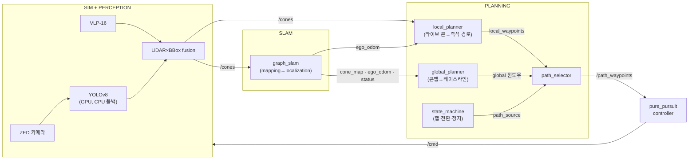

<div align="center">

# 🏎️ HYU Formula Student — Autonomous Stack

**Perception → SLAM → Planning → Control**, 시뮬레이터에서 완전 자율주행까지.


</div>

---

## ⚡ Quick Start

```bash
race            # 이거 하나. sim+perception+planning 전체가 뜨고 차가 스스로 달림
race stop       # 전부 종료   |   race attach — 재접속
```

tmux 창 하나에 4개 pane이 뜹니다: ①sim+perception ②planning(SLAM+global/local+상태기계+selector+controller) ③미션 자동 ARM ④라이브 모니터(path_source/state/lap/CTE). **teleop 불필요** — 컨트롤러가 유일한 `/cmd` writer로 직접 주행합니다.

<details>
<summary><b>모듈별로 따로 띄우려면</b></summary>

```bash
simfull track:=small_track    # ① sim + YOLO perception (+RViz)
pbring                        # ② planning 전체 (자체 graph_slam 포함 — slam 계열과 같이 켜지 말 것)
mission                       # ③ 미션 ARM → 5초 뒤 자율주행 시작
```
계획만 보고 싶으면 `pbring enable_controller:=false`, 수동 주행은 그 상태에서 `teleop`.
</details>

---

## 🧭 파이프라인



**2단계 주행 시나리오** — 이게 설계의 핵심입니다:

| 단계 | path_source | 무슨 일이 |
|---|---|---|
| **랩 1 · 탐험** | `LOCAL` | 맵 없음. local_planner가 **라이브 `/cones`로 즉석 경로** 생성, SLAM은 주행하며 콘맵 축적 |
| **핸드오프** | — | 랩 완주 → SLAM `localization` 전환 → global_planner가 콘맵에서 **레이스라인** 생성 → selector가 안전 전환 |
| **랩 2+ · 레이싱** | `GLOBAL_FULL` | 컨트롤러가 레이스라인 롤링 윈도우 추종. **CTE HUD**가 추종 오차(d) 표시 |
| **종료** | — | state_machine이 스톱존 감지 → `stop_request` → 제동 |

컨트롤러는 항상 `/path_waypoints` 하나만 봅니다 — local이냐 global이냐는 selector가 숨겨줍니다.

---

## 🛠️ Setup

### 1. 시스템 의존성 (apt)

```bash
sudo apt update && sudo apt install -y \
  python3-colcon-common-extensions python3-rosdep python3-vcstool python3-venv \
  gazebo ros-humble-gazebo-dev ros-humble-gazebo-ros ros-humble-gazebo-plugins \
  ros-humble-sbg-driver ros-humble-libg2o ros-humble-rviz-2d-overlay-plugins \
  python3-pandas python3-opencv \
  libeigen3-dev libboost-dev libspdlog-dev libomp-dev

sudo rosdep init 2>/dev/null; rosdep update   # 최초 1회
```

| 패키지 | 쓰는 곳 |
|---|---|
| `gazebo` + `gazebo-*` | 시뮬레이터 |
| `sbg-driver` | INS/GNSS 브리지 (ins_pipeline) |
| `libg2o` | graph SLAM 최적화 |
| `rviz-2d-overlay-plugins` | RViz HUD (CTE/상태/GNSS) |
| `eigen / boost / spdlog / omp` | frenet_conversion (CLCS) |
| `pandas / opencv` | eufs_launcher·eufs_tracks (pandas), trajectory_generator·perception (opencv) |

### 2. 외부 소스 & 파이썬 환경

```bash
# (a) frenet_conversion이 컴파일하는 CommonRoad-CLCS
git clone --depth 1 https://github.com/CommonRoad/commonroad-clcs.git ~/commonroad-clcs

# (b) trajectory_generator용 (시스템 파이썬)
python3 -m pip install --user quadprog

# (c) YOLO 전용 격리 venv (torch가 ROS numpy를 깨지 않도록)
python3 -m venv --system-site-packages ~/fsk/.venv-yolo
source ~/fsk/.venv-yolo/bin/activate
pip install -U pip
pip install torch torchvision --index-url https://download.pytorch.org/whl/cu124  # GPU
pip install ultralytics "numpy<2"          # numpy<2 = ROS/cv_bridge ABI 호환
pip uninstall -y opencv-python              # 시스템 cv2 사용
deactivate
```

> YOLO 체크포인트는 `eufs_perception_baseline/models/fsoco_yolov8n/weights/best.pt`. launch가 venv를 자동 감지하고, GPU가 죽어 있으면 CPU로 자동 폴백합니다.

### 3. 빌드

```bash
cd ~/fsk && export EUFS_MASTER=$PWD
rosdep install --from-paths src --ignore-src -r -y
colcon build --symlink-install
```

### 4. Shell aliases

`~/.zshrc`(또는 `~/.bashrc`) 맨 아래에 — bash·zsh 공용:

```bash
# ===== HYU Formula Student =====
export EUFS_MASTER="$HOME/fsk"
if [ -n "$ZSH_VERSION" ]; then _fsk_ext=zsh; else _fsk_ext=bash; fi
[ -f "$EUFS_MASTER/install/setup.$_fsk_ext" ] && source "$EUFS_MASTER/install/setup.$_fsk_ext"

alias fsk='cd "$EUFS_MASTER"'
alias fsb='cd "$EUFS_MASTER" && colcon build --symlink-install && source install/setup.$_fsk_ext'

# 실행
alias race='$EUFS_MASTER/src/scripts/race.sh'      # 자율주행 전체 한 방 (tmux). 종료: race stop
alias simfull='ros2 launch eufs_launcher simulation.launch.py perception:=true rviz:=true'
alias pbring='ros2 launch planning_bringup local_global_planning.launch.py'
alias teleop='ros2 run eufs_teleop teleop'

# 헬퍼
alias mission='ros2 service call /ros_can/set_mission eufs_msgs/srv/SetCanState "{ami_state: 14}"'
alias resetcar='ros2 service call /ros_can/reset_vehicle_pos std_srvs/srv/Trigger'
alias slamreset='ros2 service call /graph_slam/start_mapping std_srvs/srv/Trigger'
alias rv='rviz2 -d "$EUFS_MASTER/install/eufs_launcher/share/eufs_launcher/config/default.rviz"'
```

적용: 새 터미널 또는 `source ~/.zshrc`.

---

## ▶️ Running

### 자율주행 (기본)
```bash
race                # small_track
race skidpad        # 트랙 지정
race peanut gazebo_gui:=true    # 트랙 뒤 인자는 simulation.launch.py로 전달 (가제보 창 켜기)
```
모니터 pane에서 `path_source: LOCAL → GLOBAL_FULL` 전환과 CTE를 실시간으로 봅니다.

### 자주 쓰는 변형
```bash
pbring enable_controller:=false      # 주행 없이 계획만 (수동 개입: teleop)
pbring local_source_mode:=slam_map   # local 경로를 라이브콘 대신 SLAM맵 기반으로
pbring planner_source:=csv           # global을 오프라인 raceline CSV로
# 저장맵으로 localization 바로 시작 (랩1 탐험 생략):
pbring graph_slam_localization_mode:=true \
       graph_slam_load_map_path:=$EUFS_MASTER/src/eufs_graph_slam/map/small_track_slam.csv
```

### 진행 확인
```bash
ros2 topic echo /planning/path_source   # LOCAL? GLOBAL_FULL?
ros2 topic echo /planning/cte           # 경로 추종 횡오차 d(m)
ros2 topic echo --once /ros_can/state_str
```

### INS/SBG 파이프라인 (선택)
실제 하드웨어 GNSS/INS 경로를 시뮬에서 검증할 때:
```bash
ros2 launch eufs_graph_slam ins_pipeline.launch.py    # pbring의 graph_slam과 동시 사용 금지
```

---

## 🗺️ Reference

<details>
<summary><b>핵심 토픽</b></summary>

| 토픽 | 타입 | 의미 |
|---|---|---|
| `/cones` | `ConeArrayWithCovariance` | perception 콘 검출 (base_footprint) |
| `/localization/cone_map` | `ConeArrayWithCovariance` | SLAM 콘 맵 (map) |
| `/localization/ego_odom` | `Odometry` | SLAM 위치추정 |
| `/graph_slam/status` | `String` | `mapping` / `localization` |
| `/global_waypoints` (+`/path`) | `WaypointArrayStamped` | 전역 레이스라인 (latched) |
| `/planning/local_waypoints` (+`/path`) | `WaypointArrayStamped` | 로컬 즉석 경로 |
| `/planning/path_source` | `String` | 상태기계의 경로 선택 (`LOCAL`/`GLOBAL_FULL`/`GLOBAL_FINAL_STOP`/`STOP`) |
| `/path_waypoints` (+`/path`) | `WaypointArrayStamped` | **selector 확정 경로 = 컨트롤러 입력** |
| `/car_state/frenet/odom` | `Odometry` | Frenet (x=s, y=d) — global 기준 |
| `/planning/cte`, `/planning/cte_rmse` | `Float32` | 추종 횡오차 d, 누적 RMSE |
| `/cmd` | `AckermannDriveStamped` | 컨트롤러 출력 (유일 writer) |

</details>

<details>
<summary><b>주요 서비스</b></summary>

```bash
ros2 service call /ros_can/set_mission eufs_msgs/srv/SetCanState '{ami_state: 14}'  # 주행 미션
ros2 service call /ros_can/reset_vehicle_pos std_srvs/srv/Trigger                   # 차 원위치
ros2 service call /graph_slam/start_mapping  std_srvs/srv/Trigger                   # 매핑 모드
ros2 service call /graph_slam/save_map       std_srvs/srv/Trigger                   # 맵 CSV 저장
```
</details>

---

## 🎛️ RViz

`race`/`simfull`이 정리된 config로 RViz를 띄웁니다 (또는 `rv`). 디스플레이는 **Sensors / Perception / SLAM / Planning / HUD** 그룹, 콘은 실제 3D 메시.

- **HUD (좌상단 스택)**: `PATH CTE`(레이스라인 대비 d·RMSE·max — global 단계에서 활성) → `SLAM 상태` → `GNSS`(INS 파이프라인 실행 시에만 채워짐)
- **원클릭 프리셋**: 아무 RViz에서나 `Add → By display type → fsk_rviz_presets → FSK Full Stack` — 토픽·QoS까지 세팅된 그룹이 통째로 추가

---

## 🧩 Packages

```
eufs_sim/                 시뮬레이터 (Gazebo, 차량 URDF, 센서, 플러그인, 런처)
eufs_msgs/                EUFS 메시지/서비스
eufs_graph_slam/          graph SLAM + INS/SBG 브리지 + CTE 모니터
eufs_perception_baseline/ YOLOv8 + LiDAR-camera fusion → /cones
eufs_teleop/              키보드 주행
fsk_rviz_presets/         RViz 원클릭 디스플레이 그룹
pure_pursuit_controller/  경로 추종 제어 → /cmd (planning과 분리된 control 계층)
scripts/                  race.sh (자율 전체 스택 tmux 런처)
planning/
  ├─ planning_bringup/    ★ planning 전체 조립 launch (아래 전부 + graph_slam + controller)
  ├─ local_planner/       라이브 콘 → 즉석 로컬 경로 (랩 1)
  ├─ global_planner/      SLAM 콘맵 → 전역 레이스라인
  ├─ frenet_conversion/   전역경로 기준 Frenet (s,d) — CTE의 원천
  ├─ state_machine/       랩 카운트 · local↔global 전환 · 스톱존
  ├─ path_selector/       local/global 중 컨트롤러가 따를 경로 확정
  └─ trajectory_generator/ 오프라인 raceline (CSV)
```

---

## 🩹 Troubleshooting

<details>
<summary><b>차가 안 움직임</b></summary>

미션 미설정이 대부분. `race`는 자동 ARM하지만 수동 실행이면 `mission` → `/ros_can/state_str`가 `AS:DRIVING`인지 확인. `/reset_world`는 차를 못 되돌리니 `resetcar`.
</details>

<details>
<summary><b>주행해도 콘맵이 안 참 / 전역경로가 안 생김</b></summary>

SLAM이 `localization` 모드면 새 콘을 안 쌓습니다 — `slamreset`으로 매핑 모드 복귀 후 주행. 전역경로는 **랩 완주 → localization 전환 후** 생성됩니다 (`/graph_slam/status` 확인).
</details>

<details>
<summary><b>perception 결과(/cones)가 안 나옴 / 매핑이 너무 느림</b></summary>

GPU가 죽으면(과거 Xid 폴트) YOLO가 CPU 폴백으로 돌며 CPU를 포화시켜 RTF가 붕괴합니다 → 재부팅으로 GPU 복구가 근본 해결. `nvidia-smi`와 `/cones` rate 확인.
</details>

<details>
<summary><b>CTE HUD가 계속 "waiting"</b></summary>

정상일 수 있음 — CTE는 **전역 레이스라인 기준**이라 global 단계 전(랩 1 local 주행)엔 데이터가 없습니다. global 전환 후에도 waiting이면 `/planning/global_path_valid` 확인.
</details>

<details>
<summary><b><code>ros2 topic hz</code>가 이상하게 낮음</b></summary>

`hz`는 벽시계 기준 → Gazebo RTF만큼 낮게 보입니다. 알고리즘은 sim-time 기반이라 무관.
</details>

<details>
<summary><b>graph_slam이 두 개 뜸 / TF 충돌</b></summary>

`pbring`(또는 `race`)은 자체 graph_slam을 띄웁니다 — `ins_pipeline.launch.py`나 `graph_slam.launch.py`를 동시에 켜지 마세요.
</details>

<details>
<summary><b>빌드/토픽이 안 보임</b></summary>

워크스페이스 미소싱. 새 터미널을 열거나 `fsk && source install/setup.zsh`. 빌드는 `fsb`.
</details>

---

<div align="center">
<sub>Built on <a href="https://gitlab.com/eufs">EUFS Simulator</a> (MIT). © HYU Formula Student.</sub>
</div>
