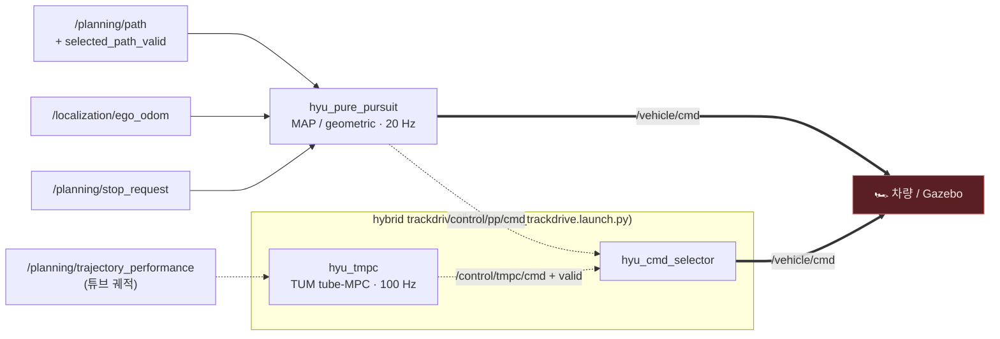

# 🎮 Control

**selector가 확정한 경로(`/planning/path`) 하나를 받아 차량 명령(`/vehicle/cmd`) 하나를 냅니다.**
경로가 local인지 global인지, 어느 미션인지는 여기서 몰라도 됩니다 — planning이 이미 숨겨줬습니다.

## Input / Output

| 방향 | 토픽 | 타입 | 역할 |
|---|---|---|---|
| in | `/planning/path` | `WaypointArrayStamped` | 추종할 경로 (**map frame 필수**) — 웨이포인트에 목표 속도 포함 |
| in | `/planning/selected_path_valid` | `Bool` | 경로 유효성 하트비트 |
| in | `/planning/stop_request` | `Bool` | 계획된 정지 (미션 종료·스톱라인) |
| in | `/localization/ego_odom` | `Odometry` | 현재 pose·속도 |
| **out** | **`/vehicle/cmd`** | `AckermannDriveStamped` | **차량으로 가는 유일한 명령** — 항상 writer가 정확히 1개 |

모든 입력은 나이 게이트(0.5 s)를 통과해야 하고, 하나라도 죽으면 즉시 안전 제동입니다.
`ros2 topic info /vehicle/cmd --verbose`로 writer가 1개인지 언제든 확인할 수 있습니다.

## 두 가지 구성

| 구성 | launch | `/vehicle/cmd` writer |
|---|---|---|
| **기본** (trackdrive·skidpad·accel) | `local_global_planning.launch.py` | Pure Pursuit 직접 |
| **hybrid** (GLOBAL 구간 TMPC) | `tmpc_trackdrive.launch.py` | `hyu_cmd_selector`만 — PP는 `/control/pp/cmd`로 밀려남 |

## 패키지

### [hyu_pure_pursuit](hyu_pure_pursuit/) — 기본 컨트롤러

횡방향은 pure pursuit, 종방향은 목표속도 P 제어. `steering_mode` 두 가지:

- **`geometric`** — 교과서 pure pursuit(`δ = atan(2·L·y / L1²)`), 고정 lookahead. skidpad·acceleration 미션용.
- **`map`** (trackdrive 기본) — ETH-PBL **Model- and Acceleration-based Pursuit**.
  속도 비례 adaptive lookahead → L1 법칙으로 목표 횡가속 `a_lat = 2v²sin(η)/L1` 계산
  → **차량 모델을 뒤집은 steering LUT**로 조향각을 찾습니다. LUT는 노드 시작 시
  Pacejka 타이어 단일트랙 모델을 정상상태까지 적분해 즉석 생성 — 외부 파일 없음.
  기하식보다 고속 코너에서 언더스티어가 없습니다.

**정지는 두 종류이고 조향이 다릅니다** — 이 구분이 이 노드의 핵심 안전 설계입니다:

| | 조건 | 조향 |
|---|---|---|
| **fail-safe brake** | 경로를 못 믿을 때 (없음·낡음·invalid) | 0 (직진) — 믿을 게 없으니 |
| **planned stop** | `stop_request` + 경로는 여전히 유효 | **경로 추종 유지** — 제동거리 v²/2a 동안 트랙을 따라감 |

### [hyu_tmpc](hyu_tmpc/) — GLOBAL 구간 고성능 컨트롤러 (선택)

TUM `mod_vehicle_dynamics_control`의 tube MPC(OSQP, 100 Hz RTI-SQP)를 코드젠 그대로
래핑한 것 + 어댑터 2개: **state bridge**(ego_odom·휠오돔·휠스피드 → TUM 차량상태,
0.2 s 데드타임 전방 적분)와 **output bridge**(MPC 힘/조향 → Ackermann 가속 명령 + validity).
path matching이 스스로 "지금 경로에서 너무 멀다"고 판단하면 출력을 끊어 selector가
PP를 유지하게 합니다 — 발산한 해를 차에 보내는 대신 물러나는 fail-closed 구조.

### [hyu_cmd_selector](hyu_cmd_selector/) — hybrid의 유일한 `/vehicle/cmd` writer

LOCAL에선 PP를 바이트 그대로 통과. GLOBAL 진입 후 TMPC가 **연속 1 s** 유효해야
인계(takeover)하고, 인계 후 fault가 나면 즉시 PP로 폴백 — 재인계도 다시 1 s를 채워야
합니다. 진입 시 PP와 조향이 0.4 rad 이상 어긋나면 인계 거부(경로 매칭이 엉뚱한
가지에 붙은 경우 방어). STOP에선 "경로 따라 제동하는 PP"를 우선하고, 그것도 없을
때만 자체 직진 제동을 냅니다.

### [hyu_control_harness](hyu_control_harness/) — 헤드리스 튜닝 하네스

Gazebo·ROS 그래프 없이 **실제 local planner + 실제 컨트롤러 + 실제 EUFS 플랜트**
(1 kHz DynamicBicycle, 0.2 s 명령 지연, 조향 레이트 제한)를 단일 스레드 ~45×
실시간으로 돌립니다. lookahead 그리드 스윕이 몇 분이면 끝납니다. 단, 인지/SLAM
오차는 없으므로(콘맵 = GT) 최종 검증은 반드시 real perception 풀스택으로.

## 튜닝 포인트

미션별 yaml은 [hyu_pure_pursuit/config/](hyu_pure_pursuit/config/) — launch가 미션에 맞게 자동 선택합니다.

| 파라미터 | 파일 | 뜻 |
|---|---|---|
| `map_lookahead_max_m` | `hyu_pure_pursuit.yaml` | **코너 커팅 노브** — `/planning/cte_rmse` 보며 조정 |
| `max_speed_mps` | 미션별 yaml | 속도 상한 (planner 목표속도와 함께 걸림) |
| `lookahead_m` | skidpad/accel yaml | geometric 모드 고정 lookahead |
| `min/brake_acceleration_mps2` | 미션별 yaml | 제동 성능 — accel 미션은 braking zone 예산과 연동 |
| `tmpc_ready_dwell_sec` | bringup launch | TMPC 인계 대기 시간 (짧으면 tube 밖에서 인계받아 발산) |

튜닝 판단은 **작은 배치로 하지 마세요** — 코너 스핀류는 배치 노이즈가 지배해서
N≥수십 런은 돌려야 제어 변경의 효과가 보입니다 (하네스가 있는 이유).
