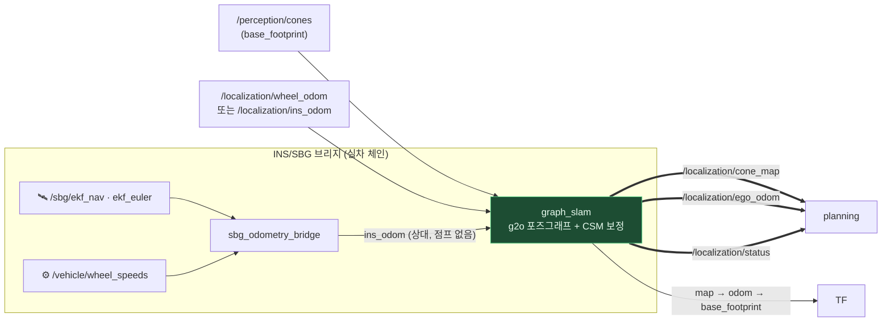

# 🗺 Localization

**인지가 준 콘 관측과 차량 오도메트리로 트랙의 콘 지도(`cone_map`)와 내 위치(`ego_odom`)를 동시에 만듭니다.**
랩 1에서 지도를 만들고(mapping), 출발점으로 돌아오면 지도를 얼려 그 위에서 위치만 푸는(localization) 2단계 생애주기가 핵심입니다.



## Input / Output

| 방향 | 토픽 | 타입 | 역할 |
|---|---|---|---|
| in | `/perception/cones` | `ConeArrayWithCovariance` | 콘 관측 (공분산 = 가중치) |
| in | `/localization/wheel_odom` (sim) / `ins_odom` (실차) | `CarState` | 키프레임 간 모션 |
| in | `/initialpose` | `PoseWithCovarianceStamped` | RViz 수동 재국지화 |
| **out** | **`/localization/cone_map`** | `ConeArrayWithCovariance` | **콘 지도** (map frame, latched) |
| **out** | **`/localization/ego_odom`** | `Odometry` | **보정된 내 위치** (map → base_footprint) |
| **out** | **`/localization/status`** | `String` | `mapping` → `mapping_converged` → `localization` |

`status`가 `localization`으로 바뀌는 순간이 전체 스택의 분기점입니다 — global planner가
이때부터 레이스라인을 만들기 시작합니다. TF는 graph_slam이 `map→odom→base_footprint`
전체를 소유합니다 (sim의 ground-truth TF는 꺼야 함).

## 어떻게 동작하나

**콘 = 랜드마크.** 키프레임(0.5 m 또는 0.2 rad마다) 포즈와 콘 랜드마크를 정점으로,
오도메트리와 관측을 간선으로 하는 2D 포즈그래프를 g2o(Levenberg)로 풉니다.

**1. 의심 많은 frontend — 콘은 바로 지도에 넣지 않습니다.**
새 관측이 기존 랜드마크와 매칭(χ² 게이트, 전역 greedy + 상호배제)에 실패하면 일단
그래프 **바깥의 tentative track**으로 둡니다. 여러 번 재관측되어 수렴한 트랙만
랜드마크로 승격하고, 그 시점에 과거 관측 이력을 원래 키프레임들에 소급 등록합니다.
유령 콘 하나가 지도에 박히면 association이 연쇄로 무너지기 때문입니다.

**2. 보정의 주역은 CSM(Correlative Scan Matching)입니다.**
최근 ~20 m의 콘 궤적을 하나의 서브맵으로 묶어 지도 격자 위에서 (x, y, θ) 전탐색 매칭:

- **tracking 모드** (localization 중) — 좁은 창(2 m)으로 상시 보정, 드리프트를 association 게이트 아래로 유지
- **loop/seam 모드** — 출발점 복귀 시 넓은 창(10 m)으로 랩 누적 드리프트를 한 번에 회수.
  **오렌지 게이트 콘 ≥2개가 보일 때만** 발화하고, 응답 표면이 애매하면(앨리어싱 능선) 스스로 기각

**mapping 중에는 게이트를 통과하지 못한 보정이 그래프를 건드릴 수 없습니다** — 지도가
만들어지는 중에 잘못된 보정이 들어가면 지도 자체가 휘기 때문입니다.

**3. 랩 완주 판정은 이중 증명을 요구합니다.**
출발점 근처 복귀(기하 조건) **그리고** 오렌지 게이트 seam CSM 등록 성공 — 둘 다
있어야 지도를 얼립니다(일반 loop edge는 증명서로 인정 안 함). 얼린 뒤에는 랜드마크가
전부 고정되고 위치 추정만 계속합니다. 고정 지도도 완전히 불변은 아니어서, 훨씬 엄격한
기준(5회 연속 히트/미스)으로만 콘 추가·삭제를 허용합니다 (오렌지 게이트 콘은 절대 삭제 불가).

**4. 절대 위치 복구는 게이트 별자리로.**
big-orange 출발 게이트 4개의 고유한 배치에서 드리프트와 무관하게 절대 SE2 포즈를
복원합니다(gate anchor). 좌우·180° 모호성은 시야 내 전체 콘의 지도 정합 수로 해소합니다.

## INS/SBG 브리지 (실차 측위 체인)

`ins_pipeline.launch.py`가 SBG Ellipse-D → `sbg_odometry_bridge` → graph_slam 체인을 띄웁니다.
브리지의 설계 원칙은 **"끊기보다 열화"** — GNSS 품질(solution mode 4=RTK … 2=AHRS)에 따라:

| mode | 동작 |
|---|---|
| 4 (RTK) | 정밀 오도메트리 (σ=0.05) |
| 3 (Float) | 계속 발행, σ=0.20으로 불신 표시 |
| 2 (AHRS) | **dead-reckoning 폴백** — 휠속 × AHRS 헤딩으로 적분 지속 |
| ≤1 | 발행 중단 → SLAM이 스냅샷으로 관성 주행 |

출력은 두 갈래: `/localization/ins_odom`(점프 없는 상대 오도메트리 — SLAM 입력)과
`/localization/gnss_odom`(절대 ENU 앵커 — HUD·진단용). GNSS 재획득 직후 3초는
공분산 바닥을 깔아 "자신만만하지만 틀린" prior를 막습니다(refix holdoff).

## 실행 · 서비스 · 맵

```bash
ros2 launch hyu_localization graph_slam.launch.py     # 휠오돔 + SLAM (sim 기본)
ros2 launch hyu_localization ins_pipeline.launch.py   # INS 체인 포함 (실차 경로)
# race/pbring에는 이미 포함 — 중복 실행 금지 (TF 충돌)
```

```bash
ros2 service call /graph_slam/save_map      std_srvs/srv/Trigger   # 지도 → map/map_<날짜>.csv
ros2 service call /graph_slam/load_map      std_srvs/srv/Trigger   # 저장맵을 고정 지도로 로드
ros2 service call /graph_slam/start_mapping std_srvs/srv/Trigger   # 매핑 모드로 리셋
ros2 service call /graph_slam/reset         std_srvs/srv/Trigger
```

저장맵으로 랩 1을 생략하려면 launch 인자 `localization_mode:=true load_map_path:=<csv>`.

## 튜닝 포인트

전부 [config/graph_slam.yaml](config/graph_slam.yaml) — 주석에 근거 있습니다.

| 파라미터 | 기본 | 뜻 |
|---|---|---|
| `keyframe_distance` | 0.5 m | 그래프 밀도 (촘촘할수록 정확·무거움) |
| `association_max_distance` / `_gate_chi2` | 1.5 / 5.991 | 관측↔랜드마크 매칭 게이트 |
| `csm_track_window_m` / `csm_loop_window_m` | 2.0 / 10.0 | CSM 탐색 창 — loop 창은 랩 드리프트를 덮어야 함 |
| `lap_returns_to_freeze` | 1 | 몇 번째 복귀에 지도를 얼릴지 |
| `odom_sigma_mode3/2` (브리지) | 0.20 | 열화 모드 오도메트리 불신 정도 — **0.5로 올리면 지도가 휨** |

## 평가

검증은 반드시 **real perception**으로 (`race perception` 또는 풀스택) — GT 콘 입력은
association 회귀를 숨깁니다. ATE·지도 품질 하네스는 `scripts/evaluate_slam.py`,
라이브 모니터는 `ate_monitor`(HUD `GNSS` 줄)입니다.
