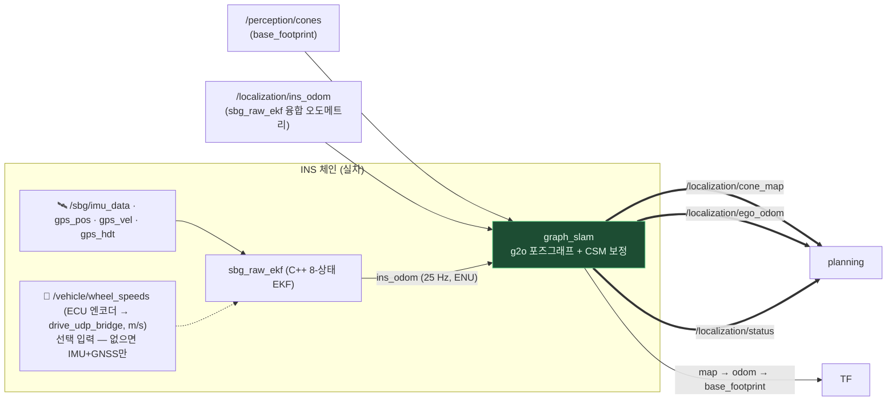

# 🗺 Localization

**인지가 준 콘 관측과 차량 오도메트리로 트랙의 콘 지도(`cone_map`)와 내 위치(`ego_odom`)를 동시에 만듭니다.**
랩 1에서 지도를 만들고(mapping), 출발점으로 돌아오면 지도를 얼려 그 위에서 위치만 푸는(localization) 2단계 생애주기가 핵심입니다.



## Input / Output

| 방향 | 토픽 | 타입 | 역할 |
|---|---|---|---|
| in | `/perception/cones` | `ConeArrayWithCovariance` | 콘 관측 (공분산 = 가중치) |
| in | `/localization/wheel_odom` (sim) / `ins_odom` (실차) | `CarState` | 키프레임 간 모션 |
| in | `/initialpose` | `PoseWithCovarianceStamped` | RViz 수동 재국지화 |
| **out** | **`/localization/cone_map`** | `ConeArrayWithCovariance` | **콘 지도** (map frame, latched) |
| **out** | **`/localization/ego_odom`** | `Odometry` | **보정된 내 위치** (map → base_footprint) |
| **out** | **`/localization/status`** | `String` | `mapping` → `mapping_converged` → `localization` |

`status`가 `localization`으로 바뀌는 순간이 전체 스택의 분기점입니다 — global planner가
이때부터 레이스라인을 만들기 시작합니다. TF는 graph_slam이 `map→odom→base_footprint`
전체를 소유합니다 (sim의 ground-truth TF는 꺼야 함).

## 어떻게 동작하나

**콘 = 랜드마크.** 키프레임(0.5 m 또는 0.2 rad마다) 포즈와 콘 랜드마크를 정점으로,
오도메트리와 관측을 간선으로 하는 2D 포즈그래프를 g2o(Levenberg)로 풉니다.

**1. 의심 많은 frontend — 콘은 바로 지도에 넣지 않습니다.**
새 관측이 기존 랜드마크와 매칭(χ² 게이트, 전역 greedy + 상호배제)에 실패하면 일단
그래프 **바깥의 tentative track**으로 둡니다. 여러 번 재관측되어 수렴한 트랙만
랜드마크로 승격하고, 그 시점에 과거 관측 이력을 원래 키프레임들에 소급 등록합니다.
유령 콘 하나가 지도에 박히면 association이 연쇄로 무너지기 때문입니다.

**2. 보정의 주역은 CSM(Correlative Scan Matching)입니다.**
최근 ~20 m의 콘 궤적을 하나의 서브맵으로 묶어 지도 격자 위에서 (x, y, θ) 전탐색 매칭:

- **tracking 모드** (localization 중) — 좁은 창(2 m)으로 상시 보정, 드리프트를 association 게이트 아래로 유지
- **loop/seam 모드** — 출발점 복귀 시 넓은 창(10 m)으로 랩 누적 드리프트를 한 번에 회수.
  **오렌지 게이트 콘 ≥2개가 보일 때만** 발화하고, 응답 표면이 애매하면(앨리어싱 능선) 스스로 기각

**mapping 중에는 게이트를 통과하지 못한 보정이 그래프를 건드릴 수 없습니다** — 지도가
만들어지는 중에 잘못된 보정이 들어가면 지도 자체가 휘기 때문입니다.

**3. 랩 완주 판정은 이중 증명을 요구합니다.**
출발점 근처 복귀(기하 조건) **그리고** 오렌지 게이트 seam CSM 등록 성공 — 둘 다
있어야 지도를 얼립니다(일반 loop edge는 증명서로 인정 안 함). 얼린 뒤에는 랜드마크가
전부 고정되고 위치 추정만 계속합니다. 고정 지도도 완전히 불변은 아니어서, 훨씬 엄격한
기준(5회 연속 히트/미스)으로만 콘 추가·삭제를 허용합니다 (오렌지 게이트 콘은 절대 삭제 불가).

**4. 절대 위치 복구는 게이트 별자리로.**
big-orange 출발 게이트 4개의 고유한 배치에서 드리프트와 무관하게 절대 SE2 포즈를
복원합니다(gate anchor). 좌우·180° 모호성은 시야 내 전체 콘의 지도 정합 수로 해소합니다.

## INS 체인 (실차 측위): `sbg_raw_ekf`

`ins_pipeline.launch.py`(sim) / `sensors.launch.py`(실차·bag)가 SBG Ellipse-D → `sbg_raw_ekf` → graph_slam 체인을 띄웁니다.
**장치 내부 EKF(`/sbg/ekf_nav`·`ekf_euler`)는 쓰지 않습니다** — 2026-08-01 실차에서 주행 중 세 번 재초기화(mode 4→0/1, 각 ~30 s)되는
동안 수신기 raw 출력(RTK 위치·Doppler 속도·듀얼안테나 헤딩)은 멀쩡했고, raw만으로 만든 오프라인 EKF(`my_ekf.py`)가 장치 EKF 기반
브리지보다 성능이 좋아 2026-08-21에 그 알고리즘을 C++로 옮겨 옛 `sbg_odometry_bridge.py`를 폐기했습니다.

구독은 raw 네 토픽뿐: `/sbg/imu_data`(25 Hz), `/sbg/gps_pos`·`gps_vel`·`gps_hdt`(5 Hz). 내부는 NED 2D EKF
(`include/hyu_localization/raw_gnss_ekf.hpp`, 상태 `[pN, pE, vN, vE, ψ, b_gz, b_ax, b_ay]`):

| 단계 | 내용 |
|---|---|
| 예측 | IMU마다 gyro.z→ψ, body accel x/y를 ψ로 회전→속도→위치. `b_ax/b_ay`가 마운트 기울기·중력 누설, `b_gz`가 자이로 바이어스 흡수. Q는 연속시간 백색잡음(`sig_acc` 0.3 m/s²/√Hz, `sig_gyro` 0.3°/s/√Hz)+바이어스 random walk |
| 보정 | `gps_pos`(N,E; R=σ²+0.02²+(v·5 ms)²), `gps_vel`(vN,vE; R=σ²+0.03²), `gps_hdt`(ψ=heading+`hdt_offset_deg`(180°), R=max(σ,0.2°)²), HDT가 3 s 이상 없고 v>1 m/s면 `gps_vel.course` 폴백 |
| 게이팅 | Mahalanobis χ²(pos/vel 20, hdt 12); 연속 기각 10회(hdt 25회)면 R×9로 받아들임(soft re-acquire) |
| ZUPT | IMU 0.5 s 창이 정지(gyro std<0.2°/s, \|mean\|<0.5°/s, 수평 accel std<0.06) + GPS 속도≈0 → 매 IMU마다 v=0(σ 2 cm/s)·ZARU(gyro.z=b_gz) 관측 |
| 모드 | 200 OK / 201 NO_HDT(헤딩 미관측: 자이로+course) / 202 COAST(GNSS 위치 1 s 이상 없음) |
| 지연 처리 | 수신기 에폭은 같은 device time의 IMU보다 ~90 ms(p50)/113 ms(p90) 늦게 도착 → 1 s 이벤트 버퍼로 되감기·재생(OOSM). 출력 지연 없이 시간순 입력과 같은 필터 상태 |

출력은 옛 브리지와 같은 계약: `/localization/ins_odom`(CarState, ENU: x=E, y=N, yaw 0=East; **base_footprint의 포즈** — 수신기 해는 주안테나의 것이라 `antenna_offset_x/y`(기본 +1.25/0 m, base 기준 x 전방)로 옮김; IMU마다 25 Hz, body twist 포함 —
정지(ZUPT) 중엔 twist 0), `/localization/gnss_odom`(raw fix 절대 ENU + 보고 σ), `/sbg_bridge/status`(DiagnosticArray: `mode`,
`motion_source`=raw_ekf/zupt/raw_ekf_no_hdt/coast/fault, `pos_age`, `hdt_age`, σ, 채택/기각 카운트, OOSM 통계),
RViz HUD `/localization/debug/gnss_overlay`. `pose.covariance[0/7]`는 σ_t=max(모드 티어 `odom_sigma_ok` 0.05 / `odom_sigma_degraded` 0.20,
EKF 위치 σ)² — coast 중엔 EKF σ가 자라 솔직하게 넓어지고, IMU 공백(`blind_gap_sec` 0.5 s) 뒤 첫 메시지는 σ=1e3(graph_slam의 "포즈 무효" 마커).
`pose.covariance[35]`는 EKF yaw 분산. 좌표는 WGS84 접평면(datum = 첫 유효 fix 또는 `datum_latitude/longitude`).

**검증(2026-08-21)**: `sbg_raw_ekf_bag_eval`로 0801 bag 세 개(17:40/17:47/17:50)를 돌리면 python 기준(`my_ekf.py`)과 전 구간
1e-6 이내 일치(모드·ZUPT 불일치 0). 수치: RTK 에폭 대비 위치 RMS 1.2–1.7 cm(p95 2.3–3.4 cm), HDT 대비 yaw std 0.29–0.40°,
coast 0 %, NO_HDT ≤1.4 %. 수신 순서(OOSM)로 돌려도 최종 상태·카운트 동일(행별 차이 ≤12 cm는 아직 안 온 ≤160 ms 에폭분).

> ⚠️ **기준점(2026-08-21 발견)**: 오도메트리 점이 base_footprint가 아니면 SLAM은 base 기준 콘을 엉뚱한 점의 자취에 붙입니다 —
> 같은 콘이 헤딩에 따라 `R(ψ)·r`만큼 다른 곳에 놓여(U턴이면 2|r|) 정차·직진은 멀쩡하고 **선회하면 지도가 붕괴**합니다. 0801 bag의 콘
> 재관측 일치도로 추정한 주안테나 위치 r=(+1.25, 0.00) m(일치도 3.0→0.9 cm). 옛 브리지(IMU 점, 안테나 0.69 m 뒤)도 같은 문제였음.
> 실차에선 `vehicle_mount.yaml`의 `sbg.imu_from_camera`(ZED 왼쪽 렌즈 기준 IMU 위치, 줄자)와 장치 설정 JSON의 lever arm으로 런치가 합성합니다 —
> 재장착 시 `imu_from_camera`를 다시 재고, 안테나를 옮겼으면 장치 lever arm을 다시 커미셔닝·JSON 재저장할 것.

> ⚠️ **EKF 리셋의 원인은 별개 문제**로 남아 있습니다. 세 번 모두 저속(≈2 m/s)·급선회(요레이트 ~35°/s) 중이었고 직전
> 수 초간 `gps1_hdt_used=0`(듀얼안테나 헤딩 거부)이었습니다. 08-01 bag의 실측 baseline은 1.50 m인데 flash된
> `leverArmPrimary/Secondary`(0.18/−1.07 m → 1.25 m)와 다르고, `leverArms/cog`=0이라 automotive 프로파일의
> 비홀로노믹 구속이 IMU 위치에 걸립니다(선회 중 course−heading 차 ~11°). 이제 장치 EKF는 안 쓰지만 안테나 이설 후
> lever arm 재설정은 여전히 권장합니다(`gps_hdt` 자체 품질).

## 실행 · 서비스 · 맵

```bash
ros2 launch hyu_localization graph_slam.launch.py     # 휠오돔 + SLAM (sim 기본)
ros2 launch hyu_localization ins_pipeline.launch.py   # INS 체인 포함 (실차 경로)
# race/pbring에는 이미 포함 — 중복 실행 금지 (TF 충돌)
```

```bash
ros2 service call /graph_slam/save_map      std_srvs/srv/Trigger   # 지도 → map/map_<날짜>.csv
ros2 service call /graph_slam/load_map      std_srvs/srv/Trigger   # 저장맵을 고정 지도로 로드
ros2 service call /graph_slam/start_mapping std_srvs/srv/Trigger   # 매핑 모드로 리셋
ros2 service call /graph_slam/reset         std_srvs/srv/Trigger
```

저장맵으로 랩 1을 생략하려면 launch 인자 `localization_mode:=true load_map_path:=<csv>`.

## 튜닝 포인트

전부 [config/graph_slam.yaml](config/graph_slam.yaml) — 주석에 근거 있습니다.

| 파라미터 | 기본 | 뜻 |
|---|---|---|
| `keyframe_distance` | 0.5 m | 그래프 밀도 (촘촘할수록 정확·무거움) |
| `association_max_distance` / `_gate_chi2` | 1.5 / 5.991 | 관측↔랜드마크 매칭 게이트 |
| `csm_track_window_m` / `csm_loop_window_m` | 2.0 / 10.0 | CSM 탐색 창 — loop 창은 랩 드리프트를 덮어야 함 |
| `lap_returns_to_freeze` | 1 | 몇 번째 복귀에 지도를 얼릴지 |
| `odom_sigma_ok` / `odom_sigma_degraded` (sbg_raw_ekf) | 0.05 / 0.20 | ins_odom 공분산의 모드별 σ 바닥(EKF σ와 max) — **0.5로 올리면 지도가 휨** |
| `hdt_offset_deg` (sbg_raw_ekf) | 180 | 듀얼안테나 HDT→차량 헤딩 오프셋(안테나 순서; 현재 차 180°) |
| `antenna_offset_x/y` (sbg_raw_ekf) | 1.25 / 0 (노드 기본) | 주안테나의 base_footprint 기준 위치 [m] — 포즈·twist를 base로 옮김. **틀리면 선회 시 지도 붕괴**. 실차 런치는 `hyu_sensor_bringup/config/vehicle_mount.yaml`의 `sbg:` 블록(카메라 기준 IMU 위치 + 장치 설정 JSON의 lever arm)에서 합성해 넘김 |
| `sig_acc` / `sig_gyro_dps` (sbg_raw_ekf) | 0.3 / 0.3 | 예측 잡음 밀도 — 키우면 GNSS를 더 믿고 IMU 관성 주행이 빨리 풀림 |
| `use_wheel_speeds` / `wheel_speeds_topic` (sbg_raw_ekf) | true / `/vehicle/wheel_speeds` | ECU 엔코더 휠속도(m/s) 융합. **선택 입력**: 샘플이 오면 후륜 평균을 `vN cosψ+vE sinψ` 관측으로 쓰고(25 Hz급 속도 관측 → COAST 드리프트·중력누설 억제), 안 오면(브리지 침묵) IMU+GNSS 필터 그대로. 진단 `wheel`=off/none/stale/fresh |
| `wheel_sigma` / `wheel_sigma_per_acc` (sbg_raw_ekf) | 0.08 m/s / 0.02 s | 휠 관측 σ = √(σ₀² + (k·\|a_x\|)²) — 가·제동 슬립 구간은 덜 믿음. `gate_wheel` 12, `max_rej_wheel` 10(연속 기각 후 R×9 재획득) |
| `wheel_scale` / `wheel_source` / `wheel_timeout` (sbg_raw_ekf) | 1.0 / rear / 0.3 s | 타이어 유효반지름 보정(RTK 속도 대비로 맞춤) / 후륜 평균 또는 4륜 평균 / 이보다 오래된 샘플은 융합 안 함. 휠이 fresh이고 \|v\|>`zupt_wheel_speed`(0.05)면 ZUPT **거부**(허용은 안 함) |
| `zupt_gyro_std_dps` / `zupt_acc_std` (sbg_raw_ekf) | 0.2 / 0.06 | 정지 판정 임계 — 느슨하면 서행을 정지로 오판 |
| `blind_gap_sec` (sbg_raw_ekf) | 0.5 | 이보다 긴 IMU 공백 뒤 첫 메시지는 σ=1e3 |
| `odom_invalid_sigma` (graph_slam) | 10 m | 이 이상 σ의 모션 입력은 "무효 선언": 동결 입력에 키프레임 안 찍고 그동안 콘 프레임 폐기 |

## 평가

검증은 반드시 **real perception**으로 (`race perception` 또는 풀스택) — GT 콘 입력은
association 회귀를 숨깁니다. ATE·지도 품질 하네스는 `scripts/evaluate_slam.py`,
라이브 모니터는 `ate_monitor`(HUD `GNSS` 줄)입니다.

INS 체인은 실측 bag으로 오프라인 채점합니다(C++ 코어를 bag에 직접 먹임; 10 GB bag도 수 초):

```bash
# device-time 순서(= my_ekf.py와 동일) — RTK 에폭 대비 위치 RMS/p95, HDT 대비 yaw std, 모드 비율 출력
ros2 run hyu_localization sbg_raw_ekf_bag_eval bag/0801_sensors/rosbag2_2026_08_01-17_47_09 --out /tmp/ekf.csv
ros2 run hyu_localization sbg_raw_ekf_bag_eval <bag> --order receipt      # 실차 수신 순서(OOSM 래퍼) — 노드가 보는 그대로
ros2 run hyu_localization sbg_raw_ekf_bag_eval <bag> --sphere             # 구면 투영: python 기준(my_ekf.py)과 비트 단위 비교용
```

단위 테스트: `test/raw_gnss_ekf_test.cpp`(정지 수렴·ZUPT, 원 궤적 추적·바이어스, 지연 에폭 재생 = 시간순 결과, 모드 전이,
device 클럭 wrap, 투영 왕복).
