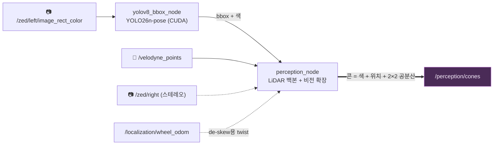

# 👁 Perception

**카메라와 LiDAR를 받아 콘 하나하나를 색·위치·신뢰도로 요약해 `/perception/cones` 한 토픽으로 내보냅니다.**
하류(SLAM)는 센서를 전혀 몰라도 됩니다 — 이 토픽이 인지의 전부입니다.



## Input / Output

| 방향 | 토픽 | 타입 | 역할 |
|---|---|---|---|
| in | `/velodyne_points` | `PointCloud2` | **백본** — 이 토픽 1프레임당 출력 1프레임 |
| in | `/zed/left/image_rect_color` | `Image` | YOLO 검출 (색 + 원거리 확장) |
| in | `/zed/right/image_rect_color` | `Image` | ZNCC 스테레오 교차검증 |
| in | `/localization/wheel_odom` | `CarState` | 점군 de-skew · 속도 비례 공분산 |
| **out** | **`/perception/cones`** | `ConeArrayWithCovariance` | **유일한 계약** — base_footprint 기준 콘 목록 |

## 설계 한 줄 요약

> **LiDAR가 위치를, 카메라가 색을 담당한다. 카메라 단독 콘은 스테레오로 검증됐을 때만 믿는다.**

거리는 LiDAR가 cm급으로 정확하고, 색은 카메라만 알 수 있습니다. 그래서 모든 콘은
"LiDAR 클러스터에 YOLO bbox를 입히는" 것이 기본이고, LiDAR가 못 보는 먼 콘만 비전이
보충합니다 — 단, 단안 깊이 추정은 절대 그대로 출력하지 않고 ZNCC 스테레오 상관으로
확인된 것만 내보냅니다. 확인에 실패하면 콘을 임의 거리로 찍는 대신 버립니다(fail-closed).

## 처리 순서

**검출기** (`yolov8_bbox_node`) — YOLO26n-pose 한 번의 forward로 bbox + 클래스(색) +
콘 키포인트를 뽑습니다. `inference_mode: lidar_locked`가 기본: LiDAR 주기당 1회,
스캔이 끝나기 직전에 맞춰 추론해 이미지↔점군 시간차를 최소화합니다.

**융합** (`perception_node`) — 점군 1프레임마다:

1. **De-skew** — 회전·주행 중 생긴 스캔 왜곡을 휠 오돔 twist로 되돌림
2. **ROI + 자차 마스크** → **RANSAC 지면 제거** (기울기 제한, 실패 시 고정 높이 컷으로 안전 폴백)
3. **DBSCAN 클러스터링** + 콘 모양(높이·폭) 필터 — 출발 게이트처럼 붙은 콘 쌍은 주성분축으로 분리
4. **bbox 투영 매칭** — 클러스터를 bbox 시각으로 모션 보상한 뒤 픽셀로 투영해 짝짓기
5. **공분산 계산** → `/perception/cones` 발행

## 콘의 네 가지 출신 (provenance)

모든 콘에는 "어떻게 만들어졌는지" 딱지가 붙습니다. 아래 우선순위 순서 그대로 배정되며,
상위에서 소진된 검출·포인트는 하위에서 재사용되지 않습니다:

| provenance | 위치 출처 | 색 | 언제 |
|---|---|---|---|
| `cluster_camera` | LiDAR 클러스터 | YOLO | **베스트 케이스** — 두 센서가 서로 확인 |
| `cluster_only` | LiDAR 클러스터 | unknown | 카메라가 못 본 클러스터 (그래도 발행) |
| `sparse` | 원시 LiDAR 1~2점 | YOLO | 클러스터가 되기엔 부족한 원거리 리턴이 bbox 안에 있을 때 |
| `monocular_zncc` | 스테레오 ZNCC | YOLO | LiDAR가 전혀 못 볼 때 — **유일한 비전 단독 콘** |

(단안 bbox-높이 깊이 추정은 내부에서 ZNCC 탐색창을 잡는 prior로만 쓰이고 절대 발행되지 않습니다.)

**운용 범위는 robust-inside-10 m** — 비전 계열(`sparse`·`monocular_zncc`)은 12 m에서 캡
(10 m 존 진입 전 2 m 온램프), LiDAR 클러스터는 캡이 없습니다.

## 공분산 — SLAM이 믿는 숫자

각 콘의 2×2 공분산은 장식이 아니라 SLAM의 가중치입니다. LiDAR 콘은 거의 등방인
상수 + 속도 비례 타이밍 항, 비전·sparse 콘은 **시선 방향으로 길쭉한 타원**
(깊이 불확실성 ≫ 횡방향)입니다. 값들은 `evaluate_perception_tiers.py`의 NEES(z²)
정합으로 맞춘 실측치입니다 — 감으로 고치지 마세요.

## 실행 & 평가

```bash
ros2 launch hyu_perception perception.launch.py   # 검출기 + 융합 (단독 실행)
race                 # 전체 스택에 포함되어 실행됨 (최상위 README)
race perception      # 평가 모드 — provenance별 recall·위치오차·공분산 정합 채점
```

평가 기준은 `/ground_truth/track`(월드 전체 콘)입니다 — `/ground_truth/cones`는 sim이
이미 FOV/거리 필터링을 한 토픽이라 기준으로 삼으면 계측기의 한계를 재게 됩니다.

## 튜닝 포인트

전부 [config/perception.yaml](config/perception.yaml) 한 파일 — 주석에 각 수치의 실측 근거가 있습니다.

| 파라미터 | 기본 | 뜻 |
|---|---|---|
| `cluster_eps` / `cluster_min_points` | 0.35 / 3 | DBSCAN 민감도 |
| `sparse_max_range_m` · `monocular_max_depth_m` | 12.0 | 비전 계열 사거리 캡 |
| `zncc_min_score` | 0.5 | 스테레오 검증 문턱 — 내리면 비전 콘↑, 유령 콘 위험↑ |
| `monocular_depth_coefficient/exponent` | 실측 fit | bbox 높이→깊이 곡선 — **카메라가 바뀌면 `fit_mono_depth_curve.py`로 재적합** |
| `projection_model` | `pinhole` | 실카메라/sim ZED는 `pinhole`, sim 합성 bbox만 `eufs_bbox` — 틀리면 조용히 매칭 실패 |

## 더 읽을거리

- [docs/current_perception_pipeline.md](docs/current_perception_pipeline.md) — 데이터플로 상세
- [models/README.md](models/README.md) — 현재 가중치(cone_pose_8kpt) 스펙과 성능
- [docs/fsoco_yolov8_finetuning.md](docs/fsoco_yolov8_finetuning.md) — 검출기 학습 핸드오프
- [docs/fusion_debug_scenarios.md](docs/fusion_debug_scenarios.md) — 융합 디버깅 절차
