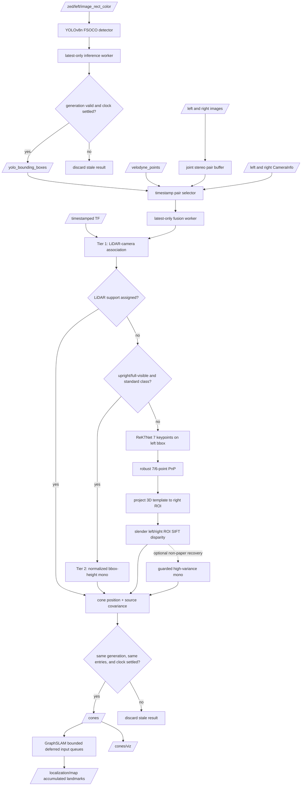

# Current Perception Pipeline

이 문서는 현재 코드가 실제로 실행하는 perception dataflow와 논문 대비 경계를
요약한다.

## Dataflow

Simulator bbox mode replaces YOLO output with `/noisy_bounding_boxes` and uses
the right-camera `/custom_camera_info` contract. Because that bbox is not a
left-image detection, stereo is disabled in this mode.

## Tier Contract

1. LiDAR support has strict priority. Ground is removed with tilt-constrained
   RANSAC, cone-sized clusters and sparse bbox-guided points are projected and
   assigned one-to-one.
2. The paper power law `D = 0.498 * h_n^-0.954` is used only for upright,
   fully-visible `blue`, `yellow`, and standard `orange` cones. `big_orange` and
   `unknown` do not use this standard-cone calibration.
3. Remaining detections run the paper's stage ordering: the public ReKTNet
   architecture predicts seven semantic keypoints, robust PnP estimates the
   cone-to-left pose, the known stereo transform projects the metric template
   into a right ROI, and SIFT disparity is evaluated only inside the resulting
   slender left/right crops. The optional horizontal-border mono recovery is
   disabled by default because it is an extra project fallback, not a paper tier.

Every invalid probability, coordinate, calibration, TF, depth, or feature match
fails closed for the affected estimate. No NaN cone or fabricated default depth
is published.

## Reset and Concurrency Contract

- ROS callbacks and all topic publication stay on `SingleThreadedExecutor`.
- YOLO and fusion computations each use one background worker and one replaceable
  pending slot, preventing an unbounded stale-frame backlog.
- A `/clock` rollback invalidates the generation before time changes, clears all
  sensor buffers and cached camera calibration, and resets dynamic TF state.
- Left/right frames are first paired one-to-one and stored as one stereo unit;
  fusion can no longer combine independently selected images from different
  acquisition cycles.
- If a bbox/cloud pair becomes ready before the delayed right-camera frame,
  fusion waits at most `stereo_pair_wait_sec` (default 0.8 s). It proceeds
  fail-closed once the right stream has passed the target or the wait expires.
- Normal-epoch sensor lead between 90 and 300 ms is retained in fixed-size
  buffers until ROS time catches up. Rollback replay remains limited to 90 ms.
  With `use_sim_time`, inputs arriving before the first nonzero `/clock` sample
  are queued rather than misclassified as far-future data.
- Old-generation completions cannot publish bbox, cone, or debug messages.
- A completion is committed only after its acquisition stamp trails active ROS
  time by `output_commit_settle_sec` (default 0.1 s), closing the ready-order
  race between a queued `/clock` rollback and a worker guard condition.
- Fusion checks queue-entry identity as well as timestamp, so a repeated numeric
  timestamp in the next rosbag loop cannot be consumed by an old job.

## Paper Fidelity Boundary

The strict priority structure, LiDAR-camera association, reported monocular
power law, and ReKTNet -> PnP -> right projection -> SIFT ordering follow the
IIT Bombay paper. The user-selected FSOCO-fine-tuned YOLOv8n replaces the paper
detector. The public Apache-2.0 ReKTNet topology and checkpoint contract are
implemented exactly, but IIT did not publish its additional 1,000-image weight,
metric 7x3 template, thresholds, or vehicle calibration. The checked-in default
template is an explicit EUFS straight-sided-cone model. The stereo tier remains
disabled by default until a compatible weight and measured template are
provisioned; once enabled, missing/incompatible weights fail startup.
This is therefore a paper-faithful reimplementation, not a bit-exact claim of
IIT's private trained model or reported accuracy.
