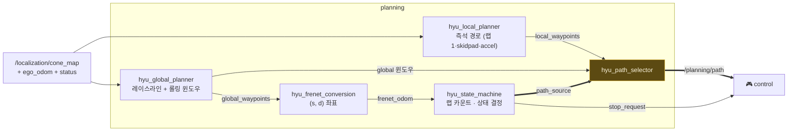

# 🧠 Planning

**SLAM의 콘 지도와 내 위치를 받아, 컨트롤러가 따라갈 단 하나의 경로 `/planning/path`를 확정합니다.**
내부에 플래너가 몇 개든(local·global·미션별 프로필) 컨트롤러는 그걸 몰라도 됩니다 —
selector가 항상 하나의 경로로 정리해 주기 때문입니다.

## Input / Output

| 방향 | 토픽 | 타입 | 역할 |
|---|---|---|---|
| in | `/localization/cone_map` | `ConeArrayWithCovariance` | SLAM 콘 지도 (latched) |
| in | `/localization/ego_odom` | `Odometry` | 내 위치 |
| in | `/localization/status` | `String` | `localization` 전환 = global 생성 신호 |
| in | `/perception/cones` | `ConeArrayWithCovariance` | 라이브 콘 (보조·게이트 마커) |
| **out** | **`/planning/path`** | `WaypointArrayStamped` | **selector가 확정한 유일한 경로** — 위치+목표속도 |
| **out** | `/planning/selected_path_valid` | `Bool` | 경로 유효성 하트비트 |
| **out** | `/planning/stop_request` | `Bool` | 정지 명령 (미션 종료·스톱존) |

**계약: `/planning/path`의 writer는 `hyu_path_selector` 하나뿐입니다.** 나머지 플래너는
전부 자기 후보 토픽(`local_waypoints`, `global_path_waypoints`)에만 씁니다. selector가
아무것도 발행하지 않으면(STOP·전 후보 무효) 컨트롤러가 알아서 제동합니다 — "경로 없음"이
곧 안전 동작이 되는 fail-closed 구조입니다.

## 2단계 주행 — 설계의 뼈대

| 단계 | path_source | 무슨 일이 |
|---|---|---|
| 랩 1 · 탐험 | `LOCAL` | local planner가 눈앞의 콘으로 즉석 경로, SLAM은 지도 축적 |
| 핸드오프 | — | 랩 완주 → SLAM `localization` → global이 레이스라인 생성 → **10 m 크로스페이드**로 전환 |
| 랩 2+ · 레이싱 | `GLOBAL_FULL` | 레이스라인 롤링 윈도우 추종 |
| 마지막 랩 | `GLOBAL_FINAL_STOP` | 스톱존에서 `stop_request` → 경로 따라 제동 |

## 패키지

### [hyu_local_planner](hyu_local_planner/) — 지도 없이도 달리는 즉석 플래너

콘만 보고 짧은 중심선을 만듭니다. 정보량에 따라 우아하게 강등되는 **우선순위 사다리**:

1. **two-sided** — 파랑·노랑 양쪽이 보이면 폭 게이트 교차 페어링 → 중점 체인
2. **one-sided** — 한쪽만 보이면 그 경계를 트랙 반폭만큼 오프셋
3. **sparse fallback** — 콘 한 쌍이라도 있으면 살금살금 전진
4. **straight-corridor** (accel 전용) — 지나온 콘까지 포함해 직선 fit, 인지가 늦어도 경로가 안 끊김

색 모르는 콘도 버리지 않고 기하로 좌우 경계에 흡수합니다. 각 경로엔 곡률 기반
속도 프로파일(`√(a_lat_max/|κ|)` 캡)이 실려 나갑니다.

### [hyu_global_planner](hyu_global_planner/) — 콘 지도 → 레이스라인

SLAM 지도가 얼면 한 번 실행되어 전체 랩 경로를 latched로 발행합니다. 세 단계:

- **지도 자가수리** — 분열된 랜드마크 병합, 드리프트 유령·코리도 밖 유령 드롭, 게이트 콘 접기.
  수리 범위가 소수(≤¼)를 넘으면 지도를 못 믿는다는 뜻이므로 **fail-closed로 거부**
- **중심선** — 경계 정렬·페어링. 시드 다중 재시도, seam은 오렌지 게이트 기준으로 회전 정렬
- **최소곡률 레이스라인** — Σκ² 최소화 QP(FISTA + 재선형화), 양쪽 경계에서
  `raceline_margin_m` 유지, 마찰원 속도 프로파일 탑재

`wpnt_publisher`가 이 경로에서 내 위치 앞 50점 윈도우를 잘라 selector에 공급하고,
TMPC용 튜브 궤적(`trajectory_performance`)도 여기서 나갑니다.

### [hyu_state_machine](hyu_state_machine/) — 언제 무엇을 따를지 결정

`path_source`(LOCAL / GLOBAL_FULL / GLOBAL_FINAL_STOP / STOP)를 발행하는 유일한 권위.

- **랩 카운트는 독립 추정기 2개의 max** — ① 물리적 오렌지 게이트 통과 감지(방향·재무장
  거리·쿨다운 가드, 랩타임의 유일한 출처) ② frenet seam 랩어라운드 폴백.
  차가 실제 주행 상태(AS_DRIVING)가 되기 전엔 카운트하지 않습니다
- LOCAL→GLOBAL 승격 조건: global 유효 + 레이스라인에서 `|d| ≤ 2 m` + 진입 dwell
- 스톱존(frenet s 구간) 진입 시 `stop_request`, 정지 유지 확인 후 `/vehicle/mission_completed`

### [hyu_path_selector](hyu_path_selector/) — 최종 관문

`path_source` 지시대로 후보 하나를 골라 `/planning/path`로 확정합니다. 신선도·ego 근접
트림을 통과한 후보만 통과. **LOCAL→GLOBAL 핸드오프는 10 m 크로스페이드**: 전환 순간의
local 경로를 얼려두고 주행거리 10 m에 걸쳐 smoothstep으로 global에 섞어 조향 점프를
없앱니다. GLOBAL_FULL에서 global이 죽으면 LOCAL로 강등해 주행을 잇지만,
GLOBAL_FINAL_STOP은 폴백 없이 fail-closed — 정지가 곧 미션이기 때문입니다.

### [hyu_frenet_conversion](hyu_frenet_conversion/) — 트랙 좌표계

ego 위치를 레이스라인 기준 (s: 진행거리, d: 횡오차)로 투영해 `/planning/frenet_odom`으로
발행합니다(CommonRoad CLCS). 랩 판정·스톱존·CTE가 전부 이 좌표 위에서 동작합니다.

### [hyu_planning_bringup](hyu_planning_bringup/) — 조립과 미션 프로필

`local_global_planning.launch.py` 하나가 위 전부 + graph_slam + 컨트롤러를 배선합니다.
미션 인자에 따라 구성 자체가 바뀝니다:

| 미션 | 구성 |
|---|---|
| **trackdrive** (기본) | 풀 구성 — local + global + selector + 상태기계 |
| **skidpad** | global 없음. `skidpad_director`가 단계(진입→우원×N→좌원×N→탈출→정지)별로 콘 지도를 걸러 local planner에 공급 |
| **acceleration** | global 없음. straight-corridor 모드 — 콘이 끝나면 경로 무효 → 자동 제동이 곧 정지 로직 |
| **dlc** | global 없음. 곡선 코리도(차선변경)라 trackdrive 튜닝 유지(`hyu_local_planner_dlc.yaml`); 양끝 오픈 트랙이므로 `stop_at_path_end` — 경로 끝으로 속도를 √(2a·d)로 테이퍼해 마지막 콘에서 계획 정지 (fail-safe 급제동 아님) |
| **hybrid TMPC** | `tmpc_trackdrive.launch.py` — GLOBAL 구간만 TMPC, 상세는 [control/README.md](../control/README.md) |

## 튜닝 포인트

| 파라미터 | 위치 | 뜻 |
|---|---|---|
| `raceline_margin_m` (1.4) | `hyu_global_planner.yaml` | **공격성 노브** — 경계에서 얼마나 붙을지 |
| `two_sided_speed_mps` · `max_lateral_accel_mps2` | 미션별 `hyu_local_planner_*.yaml` | 랩 1 / 미션 속도 |
| `target_lap_count` | launch 인자 | 총 랩 수 (final stop은 target−1 랩부터 준비) |
| `max_abs_d_for_global` (2.0) | `planning_hyu_state_machine.yaml` | 레이스라인에서 이만큼 안쪽이어야 GLOBAL 승격 |
| `transition_blend_length_m` (10) | `hyu_path_selector.yaml` | 핸드오프 크로스페이드 길이 |

## 디버깅 한 줄

경로가 안 나올 땐 이유가 이미 발행되고 있습니다:
`/planning/local_path_reason` · `/planning/global_path_reason` (유효하면 빈 문자열) —
RViz Stack HUD가 같은 내용을 스테이지별 색상으로 보여줍니다.
